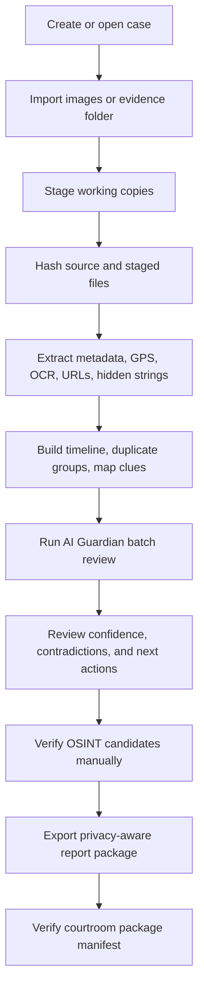

<div align="center">

# GeoTrace Forensics X

### Offline Image Forensics • Geolocation Triage • OSINT Intelligence • AI-Assisted Case Reporting

**Version 12.9.2 — AI Guardian v5 / Deep Context Reasoner**  
**Public Release Candidate**

[](#requirements)
[](#quick-start)
[](#project-architecture)
[](#core-capabilities)
[](#ai-guardian-v5)
[](#privacy-and-safety-model)
[](LICENSE)

> **GeoTrace Forensics X** is a professional desktop workspace for analyzing image evidence, extracting metadata, investigating GPS and map clues, building OSINT hypotheses, detecting timeline and authenticity anomalies, preserving chain of custody, and exporting analyst-ready forensic reports.

</div>

---

## Table of Contents

- [Why GeoTrace Exists](#why-geotrace-exists)
- [What Makes This Build Special](#what-makes-this-build-special)
- [Core Capabilities](#core-capabilities)
- [AI Guardian v5](#ai-guardian-v5)
- [OSINT and Map Intelligence](#osint-and-map-intelligence)
- [Evidence Strength Model](#evidence-strength-model)
- [Privacy and Safety Model](#privacy-and-safety-model)
- [Screenshots](#screenshots)
- [Quick Start](#quick-start)
- [OCR / Tesseract Setup](#ocr--tesseract-setup)
- [Recommended Investigation Workflow](#recommended-investigation-workflow)
- [Report and Export System](#report-and-export-system)
- [Project Architecture](#project-architecture)
- [Testing](#testing)
- [Windows Packaging](#windows-packaging)
- [Demo Corpus](#demo-corpus)
- [Limitations](#limitations)
- [Roadmap](#roadmap)
- [Security, Privacy, and Responsible Use](#security-privacy-and-responsible-use)
- [License](#license)

---

## Why GeoTrace Exists

Modern image investigations rarely depend on a single piece of evidence. A photo may contain native EXIF GPS, visible map labels, OCR text, filenames, social-media UI fragments, hidden strings, edited timestamps, duplicate variants, and privacy-sensitive pivots. Each signal has a different level of forensic strength.

GeoTrace Forensics X was built to help analysts answer questions like:

- Does this image contain native GPS coordinates, derived map clues, or only weak visual hints?
- Are there contradictions between timestamp, GPS, duplicate groups, and source context?
- Is a screenshot showing a place, searching for a place, or proving the device was physically there?
- Which evidence item is strong enough for reporting, and which item needs corroboration?
- Can a clean forensic package be exported without leaking private paths, OCR text, usernames, URLs, or sensitive location pivots?

GeoTrace is not a black-box verdict engine. It is an **explainable investigation assistant** that keeps the analyst in control.

---

## What Makes This Build Special

### v12.9.2 — AI Guardian v5 / Deep Context Reasoner

This release strengthens the AI-assisted layer without breaking the original forensics foundation.

| Area | Upgrade |
|---|---|
| AI reasoning | Deep context reasoning across GPS, OCR, map URLs, duplicates, timestamps, hidden-content signals, and privacy pivots. |
| OSINT intelligence | Stronger CTF GeoLocator workflow, region-aware clue extraction, query builder v2, local landmark matching, and structured hypotheses. |
| Map safety | Map screenshots and route overlays are treated as **displayed/searched-place leads**, not device-location proof unless corroborated. |
| Evidence language | Clear separation between **proof**, **lead**, and **weak signal** to avoid overstating conclusions. |
| Report safety | Privacy-aware report modes with manifest integrity checks and courtroom package verification. |
| Release cleanup | Unified versioning, organized patch notes, improved packaging, screenshot checklist, and production/demo PyInstaller specs. |

---

## Core Capabilities

### Image Forensics

- EXIF and native metadata extraction.
- GPS coordinate decoding.
- Timestamp recovery and normalization.
- Camera/software/source-profile hints.
- Hidden-content and embedded-string triage.
- File signature and structural anomaly detection.
- Source hash and staged working-copy hash verification.
- Duplicate and near-duplicate grouping using perceptual and contextual checks.

### Geolocation and Map Analysis

- Native GPS extraction and map visualization.
- Google Maps-style URL parsing.
- `geo:` URI parsing.
- DMS coordinate parsing.
- Plus Code signal detection.
- OCR-based map-label extraction.
- Candidate place ranking.
- Country and region classification.
- CTF-style location solvability scoring.

### OSINT Workbench

- Structured OSINT entities.
- Structured location hypotheses.
- Corroboration matrix.
- Analyst verification decisions.
- Search pivot generation.
- Privacy review before external lookup.
- OSINT appendix export.

### Case Management

- Case creation and switching.
- Evidence staging.
- Chain-of-custody logging.
- Snapshot backup and restore.
- Report package generation.
- Release-ready manifest validation.

### Reporting

- HTML report.
- PDF report.
- JSON export.
- CSV export.
- Executive summary.
- Validation summary.
- Courtroom package.
- OSINT appendix.
- SHA-256 manifest verification.

---

## AI Guardian v5

AI Guardian is GeoTrace's local reasoning layer. It does not replace the analyst. It reviews the evidence context, highlights risky patterns, and explains why an item deserves attention.

### AI Guardian reviews

- Location outliers.
- Impossible travel patterns.
- Timeline contradictions.
- Duplicate context conflicts.
- Metadata authenticity clusters.
- Hidden-content indicators.
- Map/OCR-derived location ambiguity.
- Privacy-sensitive export pivots.
- Courtroom readiness gaps.

### AI output stored per evidence item

Each analyzed evidence record can include:

```text
ai_provider
ai_score_delta
ai_confidence
ai_risk_label
ai_summary
ai_flags
ai_reasons
ai_breakdown
```

These values appear in the UI, score breakdowns, analyst notes, HTML/PDF/JSON/CSV exports, executive summaries, validation summaries, and courtroom packages.

### Example AI reasoning style

```text
AI-assisted review: Review recommended
Score delta: +22
Flags: impossible_travel, derived_location_only
Reason: The item contains a map-derived location clue and a timestamp that conflicts with nearby GPS-confirmed evidence. Treat as a location lead until source-app records or native GPS corroborate it.
```

### Offline-first design

The default AI layer is deterministic and local. Optional ML components can be installed for enhanced geospatial outlier detection, but the application does not upload evidence automatically.

---

## OSINT and Map Intelligence

GeoTrace separates location evidence into different trust levels. This is critical because a screenshot of a map is not the same thing as a camera photo with native GPS.

### Location evidence priority

| Priority | Signal Type | Interpretation |
|---:|---|---|
| 1 | Native GPS EXIF | Strongest built-in location signal. Still requires acquisition and device context. |
| 2 | Source-app location record | Strong when backed by app/cloud acquisition logs. |
| 3 | Map URL / coordinates shown in content | Strong lead, but may represent a searched/displayed place. |
| 4 | OCR place labels | Useful lead requiring corroboration. |
| 5 | Visual landmark/context | Useful for OSINT triage, weaker without confirmation. |
| 6 | Filename-only hints | Weak triage clue only. Never treated as proof. |

### CTF GeoLocator workspace

The CTF GeoLocator page is designed for authorized CTF, GeoGuessr-style training, and controlled OSINT practice.

It provides:

- `CTFClue` cards.
- Ranked `GeoCandidate` entries.
- Location Solvability Score.
- Manual search pivots.
- Local landmark matching.
- Candidate verification actions.
- CTF writeup export.

### OCR Search Query Builder v2

The query builder extracts and combines useful OSINT pivots from:

- Arabic phrases.
- English phrases.
- Map labels.
- Domains.
- Phone-like strings.
- Coordinates.
- Place candidates.
- Region hints.

External searches remain manual and privacy-gated.

---

## Evidence Strength Model

GeoTrace uses conservative language to reduce false confidence.

| Strength | Meaning |
|---|---|
| Proof | Strong forensic signal such as native GPS or verified source metadata. Still subject to analyst validation. |
| Lead | Useful investigative direction such as OCR place names, map URLs, route overlays, or repeated contextual clues. |
| Weak Signal | Filename hints, vague visual context, low-confidence OCR, or uncorroborated assumptions. |

This model is used across AI Guardian, Map Intelligence, OSINT Workbench, and report output.

---

## Privacy and Safety Model

GeoTrace is designed around a strict investigation posture:

- Offline-first by default.
- No automatic reverse-image upload.
- No automatic online search.
- Manual privacy review before external OSINT pivots.
- Redaction-aware exports.
- Separate production and demo packaging.
- Courtroom package verification for manifest hashes and leakage checks.

### Export privacy levels

GeoTrace supports privacy-aware reporting so sensitive evidence context can be reduced before sharing.

Examples of protected data classes:

- Local file paths.
- OCR text.
- URLs.
- Usernames.
- Emails.
- Location entities.
- Source-machine identifiers.

---

## Screenshots

Add real screenshots before publishing the final public repository.

| Screen | Suggested path |
|---|---|
| Dashboard | `screenshots/dashboard.png` |
| Evidence Review | `screenshots/evidence_review.png` |
| Geo / Map Intelligence | `screenshots/geo_page.png` |
| AI Guardian | `screenshots/ai_guardian.png` |
| OSINT Workbench | `screenshots/osint_workbench.png` |
| CTF GeoLocator | `screenshots/ctf_geolocator.png` |
| Report Export | `screenshots/report_export.png` |
| Courtroom Verifier | `screenshots/courtroom_verifier.png` |

> Do not publish placeholder images as final screenshots. Use `screenshots/README.md` as the capture checklist.

---

## Quick Start

### Requirements

- Python 3.11 or newer.
- Windows 10/11, Linux, or macOS.
- Tesseract OCR installed separately for OCR features.
- Optional: `scikit-learn` for enhanced ML-backed geo-outlier detection.

### Run from source

```powershell
python -m venv .venv
.\.venv\Scripts\activate
python -m pip install --upgrade pip
python -m pip install -r requirements.txt
python main.py
```

### Windows convenience scripts

```powershell
setup_windows.bat
run_windows.bat
```

### Optional AI / ML backend

```powershell
python -m pip install -r requirements-ai.txt
```

If the optional backend is unavailable, GeoTrace falls back to transparent rule-based heuristics.

---

## OCR / Tesseract Setup

GeoTrace uses `pytesseract` as the Python bridge, but the native Tesseract engine must be installed on the operating system.

Without Tesseract, the app still runs, but OCR-derived text, map labels, usernames, domains, and location clues will be limited.

### Windows

Install Tesseract and keep the default path when possible:

```text
C:\Program Files\Tesseract-OCR\tesseract.exe
```

Then add the folder to your `PATH` and verify:

```powershell
tesseract --version
```

### Linux / Kali / Debian / Ubuntu

```bash
sudo apt update
sudo apt install -y tesseract-ocr tesseract-ocr-eng tesseract-ocr-ara
tesseract --version
```

### macOS

```bash
brew install tesseract
tesseract --version
```

---

## Recommended Investigation Workflow



### Practical analyst flow

1. Create or select a case.
2. Import images or a folder.
3. Review source/staged hashes.
4. Inspect EXIF, timestamps, GPS, OCR, URLs, and hidden strings.
5. Open Geo / Map Intelligence for location interpretation.
6. Use AI Guardian to identify contradictions and priority actions.
7. Use OSINT Workbench for hypotheses, entities, and privacy review.
8. Export the correct report mode: internal, shareable, or courtroom.
9. Verify the exported package using the Courtroom Verifier.

---

## Report and Export System

GeoTrace can generate multiple report formats depending on audience and privacy requirements.

| Export | Purpose |
|---|---|
| HTML report | Rich technical report for analyst review. |
| PDF report | Portable report for academic or case submission. |
| JSON export | Machine-readable evidence data. |
| CSV export | Spreadsheet-friendly summary. |
| Executive summary | High-level, non-technical overview. |
| Validation summary | Test/demo validation and expected-output comparison. |
| Courtroom package | Integrity-focused package with manifest and verifier checks. |
| OSINT appendix | Structured OSINT hypotheses, entities, candidates, and analyst decisions. |

### Package integrity

Report packages include SHA-256 integrity metadata so exported assets can be checked after transfer.

---

## Project Architecture

```text
GeoTrace Forensics X
├── app/
│   ├── agents/                  Local agent contracts and rule-based assistant bridge
│   ├── config.py                App identity, version, channel, and release flavor
│   ├── core/
│   │   ├── ai/                  AI Guardian, confidence, evidence graph, context reasoning
│   │   ├── case_manager/        Case pipeline and snapshot orchestration
│   │   ├── cases/               Evidence staging helpers
│   │   ├── exif/                Image signature and metadata helpers
│   │   ├── map/                 Map evidence strength helpers
│   │   ├── osint/               OSINT entities, hypotheses, CTF candidates, query builder
│   │   ├── reports/             Privacy modes, package assets, verifier, OSINT appendix
│   │   ├── vision/              Deterministic visual/map cue helpers
│   │   ├── anomalies.py         Forensic anomaly scoring
│   │   ├── case_db.py           Case persistence
│   │   ├── exif_service.py      Metadata/OCR/hidden-content extraction
│   │   ├── map_intelligence.py  Location and map clue processing
│   │   └── validation_service.py
│   ├── ui/
│   │   ├── controllers/         Navigation/controller helpers
│   │   ├── mixins/              Split main-window behavior modules
│   │   ├── pages/               AI Guardian, OSINT Workbench, CTF GeoLocator
│   │   ├── dialogs.py
│   │   ├── main_window.py
│   │   ├── splash.py
│   │   ├── styles.py
│   │   └── widgets.py
│   └── __init__.py
├── assets/                      App icon and splash screen
├── data/osint/                  Local landmark dataset
├── demo_evidence/               Demo corpus for classroom/testing
├── docs/releases/               Organized patch notes
├── screenshots/                 Real screenshot capture area
├── tests/                       Unit, regression, smoke, report, AI, OSINT tests
├── main.py                      Application entry point
├── make_release.bat             Release gate and packaging script
├── geotrace_forensics_x.spec    Production PyInstaller spec
└── geotrace_forensics_x_demo.spec
```

### Internal design principles

- Keep forensic extraction deterministic.
- Keep AI explainable and reviewable.
- Treat OSINT as hypothesis building, not automatic proof.
- Separate production packages from demo/classroom assets.
- Make reports privacy-aware by default.
- Keep future AI-agent integration possible through clear contracts.

---

## Testing

Run the full test suite:

```powershell
python -m pytest -q
```

Run compile checks:

```powershell
python -m compileall -q app tests main.py
```

Run linting if enabled in your environment:

```powershell
python -m ruff check .
```

Important test groups include:

- AI engine and deep context reasoning.
- AI Guardian verifier checks.
- OSINT structured output.
- OSINT image intelligence.
- Map intelligence hardening.
- CTF candidate actions.
- Report smoke tests.
- Release readiness tests.
- UI import smoke tests.

---

## Windows Packaging

### Production release build

Use the production release script:

```powershell
make_release.bat
```

The release script is intended to:

1. Clean cache/build/temp artifacts.
2. Run compile checks.
3. Run tests.
4. Build the production EXE.
5. Create a release ZIP.
6. Write `SHA256SUMS.txt`.

### Manual EXE build

```powershell
.\build_windows_exe.bat
```

Then test:

```powershell
dist\GeoTraceForensicsX\GeoTraceForensicsX.exe
```

### Demo build

Use the demo spec only for classroom/demo builds:

```powershell
.\build_windows_demo_exe.bat
```

Production packages should use:

```text
geotrace_forensics_x.spec
```

Demo/classroom packages may use:

```text
geotrace_forensics_x_demo.spec
```

---

## Demo Corpus

The repository includes `demo_evidence/` for controlled testing and presentations.

Demo scenarios include:

- EXIF and GPS recovery.
- Map screenshot interpretation.
- Duplicate detection.
- Missing metadata triage.
- Hidden-content scan.
- Timeline conflict example.
- OSINT and CTF geolocation workflow.

> Do not treat demo evidence as real case data. It exists for validation, screenshots, demos, and academic presentation only.

---

## Build Identity

| Field | Value |
|---|---|
| App | GeoTrace Forensics X |
| Version | `12.9.2` |
| Channel | `Public Release Candidate` |
| Release flavor | `AI Guardian v5 / Deep Context Reasoner` |
| Organization | `Cyber Forensics Team` |
| Default analyst | `Lead Analyst` |
| Primary use | Academic digital-forensics investigation, controlled OSINT practice, CTF geolocation triage, and report generation |

---

## Limitations

GeoTrace is designed for triage, analysis, and reporting support. It should not be treated as a single-source authority.

Important limitations:

- OCR quality depends on image quality and Tesseract language packs.
- Map screenshots may show searched/displayed places, not device location.
- Filename hints are weak and can be misleading.
- Native metadata may be absent, modified, or stripped by platforms.
- Optional ML output is assistive and must be reviewed.
- OSINT pivots require manual validation and privacy review.
- Courtroom use requires proper acquisition process, legal context, and independent verification.

---

## Roadmap

### Near-term hardening

- More UI smoke tests.
- Stronger map-label OCR preprocessing.
- Better Arabic/English OCR profiles.
- More validation corpus coverage.
- More report verifier rules.
- Wider test coverage for export privacy modes.

### OSINT and AI expansion

- Larger offline landmark dataset.
- Stronger country/region classifier.
- More structured entity graph views.
- Analyst feedback loop for candidate ranking.
- Optional local vision model integration.
- Stronger local CLIP-style backend support.

### Product polish

- More professional screenshots.
- Improved onboarding/demo walkthrough.
- Better packaged release notes.
- UI refinements for evidence cards and AI reasoning panels.
- More print-friendly executive reports.

---

## Security, Privacy, and Responsible Use

GeoTrace Forensics X is intended for:

- Academic digital-forensics projects.
- Authorized investigations.
- CTF and training environments.
- Internal evidence triage.
- Controlled OSINT learning.

Do not use GeoTrace to stalk, harass, deanonymize, or investigate people without authorization. Always follow applicable laws, platform rules, evidence-handling requirements, and privacy obligations.

Read the included documents before public release:

- [`SECURITY.md`](SECURITY.md)
- [`PRIVACY.md`](PRIVACY.md)
- [`DISCLAIMER.md`](DISCLAIMER.md)
- [`THIRD_PARTY_NOTICES.md`](THIRD_PARTY_NOTICES.md)
- [`RELEASE_CHECKLIST.md`](RELEASE_CHECKLIST.md)

---

## Contributing

Suggested contribution areas:

- OCR preprocessing improvements.
- Arabic/English location extraction.
- Report formatting.
- Test coverage.
- Demo corpus improvements.
- Privacy verifier rules.
- Offline landmark dataset expansion.
- UI polish and accessibility.

Before submitting changes:

```powershell
python -m compileall -q app tests main.py
python -m pytest -q
```

---

## License

This project is released under the MIT License. See [`LICENSE`](LICENSE) for details.

---

<div align="center">

**GeoTrace Forensics X**  
Evidence first. AI explained. Privacy respected.

</div>
