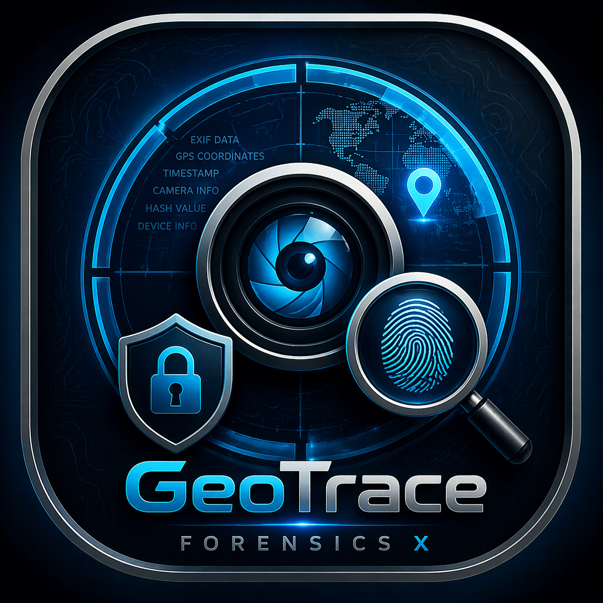

<p align="center">
  
</p>

<h1 align="center">GeoTrace Forensics X</h1>

<p align="center">
  <strong>Local-first forensic image triage, geo-evidence review, OCR/map intelligence, digital-risk scoring, and court-aware reporting.</strong>
</p>

<p align="center">
  
  
  
  
  
</p>

<p align="center">
  <strong>Current release:</strong> v12.10.31 &nbsp;|&nbsp; <strong>Build channel:</strong> Optional Stack Doctor + GeoData Ready
</p>

---

## Overview

**GeoTrace Forensics X** is a desktop forensic analysis workbench designed to help analysts review image-based evidence, preserve case integrity, extract technical and contextual signals, separate strong evidence from weak investigative leads, and generate structured reports.

GeoTrace is built around a conservative forensic principle:

> **Native GPS is evidence. OCR/map/visual clues are leads until independently corroborated.**

The project focuses on:

- image evidence intake and case organization;
- file hashing and custody tracking;
- EXIF/container metadata extraction;
- GPS normalization and map-provider verification links;
- OCR-driven map and place clue extraction;
- digital-risk and privacy-exposure scoring;
- AI Guardian cards with calibrated confidence instead of exaggerated claims;
- local-first reporting, package verification, and release hygiene.

GeoTrace does **not** silently upload evidence files to online services. Online OSINT/map lookup is privacy-gated and disabled by default.

---

## Table of Contents

- [Overview](#overview)
- [Why GeoTrace Exists](#why-geotrace-exists)
- [Core Capabilities](#core-capabilities)
- [Evidence Strength Model](#evidence-strength-model)
- [Screens and Workspaces](#screens-and-workspaces)
- [Quick Start](#quick-start)
- [Installation](#installation)
- [Optional Stacks](#optional-stacks)
- [Offline Geo Data](#offline-geo-data)
- [Local Vision and AI](#local-vision-and-ai)
- [Runtime Configuration](#runtime-configuration)
- [Recommended Workflow](#recommended-workflow)
- [Reports and Exports](#reports-and-exports)
- [Architecture](#architecture)
- [Project Structure](#project-structure)
- [Command Line Tools](#command-line-tools)
- [Testing and Validation](#testing-and-validation)
- [Build and Release](#build-and-release)
- [Privacy and Security Model](#privacy-and-security-model)
- [Troubleshooting](#troubleshooting)
- [Roadmap](#roadmap)
- [Responsible Use](#responsible-use)
- [Contributing](#contributing)
- [License](#license)

---

## Why GeoTrace Exists

Digital image investigations often suffer from two opposite problems:

1. **Under-analysis** — important metadata, map clues, timestamps, OCR text, and hidden-content indicators are missed.
2. **Over-claiming** — weak OCR, filenames, visual guesses, or map screenshots are incorrectly treated as confirmed location evidence.

GeoTrace is designed to sit in the middle: it extracts as much useful context as possible, but labels each signal according to its evidential strength.

A screenshot of a map is not the same thing as native EXIF GPS. A city name found by OCR is not the same thing as a device coordinate. A visual clue is not a legal conclusion. GeoTrace keeps those categories separate so reports stay useful, honest, and defensible.

---

## Core Capabilities

| Area | Capability | Purpose |
|---|---|---|
| Case Management | case storage, record review, evidence timeline | keep investigations organized |
| Integrity | source hash, working-copy hash, package verification | preserve chain-of-custody context |
| Metadata | EXIF, container hints, timestamp review, GPS parsing | recover technical evidence from images |
| GPS and Maps | native GPS repair, provider bridge, map URL parsing | verify coordinates across map providers |
| OCR | bounded OCR, crop review, map screenshot zones | extract useful text without freezing the UI |
| Geo Intelligence | offline geocoder, aliases, fuzzy matching, confidence ladder | detect place leads conservatively |
| Digital Risk | privacy exposure, manipulation suspicion, technical threat signals | classify risk without false malware claims |
| AI Guardian | compact triage cards, evidence basis, next actions | make analyst decisions clearer |
| Reporting | preview, HTML/PDF/CSV/JSON exports, claim matrix | produce structured case outputs |
| Validation | labelled datasets, benchmark helper, smoke tests | measure accuracy and reduce false positives |
| Release Hygiene | audit script, clean artifacts, PyInstaller spec | prepare clean external builds |

---

## Evidence Strength Model

GeoTrace avoids mixing different evidence types into one vague “location found” result. It uses a layered confidence model.

| Layer | Meaning | Strength |
|---|---|---|
| **Native GPS** | coordinates stored in image metadata | strongest location evidence |
| **Metadata Context** | EXIF timestamps, device/model/software clues | strong technical context |
| **Derived Geo Anchor** | parsed coordinate from map URL, OCR label, or map screenshot | useful lead, not native GPS |
| **Map Search Lead** | place/city/landmark text from OCR or aliases | investigative lead |
| **Visual Landmark Lead** | visual or local-vision candidate | weak to medium lead depending on corroboration |
| **Filename-only Signal** | location-like word in filename only | intentionally weak; should not drive conclusions |
| **No Geo Anchor** | no reliable geo evidence | report as unknown, not guessed |

This model helps analysts distinguish between:

- **confirmed device-provided coordinates**,
- **coordinates visible inside a screenshot**, and
- **textual or visual clues that require manual validation**.

---

## Screens and Workspaces

GeoTrace includes multiple UI modes and workspaces so the same tool can be used for demos, normal analysis, and technical review.

### Workspace Modes

| Mode | Best For | Typical Pages |
|---|---|---|
| **Executive** | demos, management review, high-level readiness | Dashboard, Reports, Cases |
| **Analyst** | normal investigation workflow | Dashboard, Review, Geo, Map Workspace, Timeline, Custody, Reports, Cases, AI Guardian |
| **Technical** | deep validation, parser review, OSINT details | all pages including OSINT Workbench and System Health |

### Main Pages

- **Dashboard** — investigation summary, risk overview, and case posture.
- **Review** — selected record details, metadata, OCR, and evidence findings.
- **Geo / Map Workspace** — native GPS, derived anchors, map screenshot mode, provider links, and internal preview.
- **Timeline** — timestamp and sequence review.
- **Custody** — hash and package/case handling information.
- **Reports** — preview and export investigation outputs.
- **AI Guardian** — calibrated risk cards and next-action recommendations.
- **OSINT Workbench** — deeper geo and CTF-style location analysis support.
- **System Health** — dependency checks, optional stack status, runtime folders, and readiness warnings.

---

## Quick Start

### 1. Extract the release ZIP

Extract the project folder somewhere simple, for example:

```text
C:\Tools\GeoTrace_v12_10_31_RELEASE_HARDENED
```

Avoid paths with very long names, special characters, or cloud-sync conflicts when building releases.

### 2. Run setup

```bat
setup_windows.bat
```

This creates a local virtual environment, installs the core dependencies, installs the safe optional UI/Geo/OSINT stack, installs developer dependencies, and runs a smoke check.

### 3. Start GeoTrace

```bat
run_windows.bat
```

### 4. Import evidence

Open the UI, create or select a case, import image evidence, then review:

- hashes,
- metadata,
- GPS status,
- OCR/map clues,
- AI Guardian cards,
- report preview.

---

## Installation

### Recommended Environment

| Item | Recommendation |
|---|---|
| OS | Windows 10/11 |
| Python | 3.10, 3.11, or 3.12 |
| RAM | 8 GB minimum, 16 GB recommended for AI/OCR-heavy workflows |
| Storage | enough free space for case data, exports, local indexes, and optional AI models |
| Network | not required for core analysis |

> Some heavy AI/OCR packages may not support the newest Python versions immediately. For best compatibility, use Python **3.10–3.12**.

### One-command Windows Setup

```bat
setup_windows.bat
```

### Manual Setup

```bat
python -m venv .venv
.venv\Scripts\python.exe -m pip install --upgrade pip
.venv\Scripts\python.exe -m pip install -r requirements.txt
.venv\Scripts\python.exe -m pip install -r requirements-ui.txt -r requirements-geo.txt -r requirements-osint.txt
.venv\Scripts\python.exe -m pip install -r requirements-dev.txt
.venv\Scripts\python.exe tools\smoke_check.py
.venv\Scripts\python.exe main.py
```

### Minimal Runtime Only

If you only want the core app without optional polish:

```bat
python -m venv .venv
.venv\Scripts\python.exe -m pip install -r requirements.txt
.venv\Scripts\python.exe main.py
```

---

## Optional Stacks

GeoTrace separates optional packages so the core application stays reliable.

### Recommended Optional Stack

Use this first for normal analyst work:

```bat
setup_recommended_stack_windows.bat
```

It installs:

- UI polish helpers;
- geo matching helpers;
- forensic metadata/barcode helpers;
- lightweight OSINT helpers.

### Full Stack

Use this when you want more optional capabilities and your machine can handle larger dependencies:

```bat
setup_full_stack_windows.bat
```

### Forensics Stack

```bat
setup_forensics_stack_windows.bat
```

Adds deeper metadata, barcode, timezone, country, and local index helpers.

### AI Stack

```bat
setup_ai_stack_windows.bat
```

Adds heavier AI-related packages. This is intentionally separate because large AI libraries can be slower to install and may require specific Python/driver compatibility.

### Stack Diagnosis

```bat
.venv\Scripts\python.exe tools\stack_doctor.py
```

This gives a readable diagnosis if System Health says optional components are missing.

---

## Offline Geo Data

GeoTrace can run with the bundled seed data, but stronger offline place matching requires a larger local geo index.

### Supported Local Inputs

The project supports importing data such as:

- GeoNames `cities15000.txt` or `cities15000.zip`;
- processed GeoNames JSON;
- controlled CSV/JSON exports from open datasets;
- local landmarks and aliases.

### Recommended Folder Layout

```text
data\geo\raw\
  cities15000.zip
  cities15000.txt

data\geo\processed\
  places_geonames.json

data\osint\
  generated_geocoder_index.json
```

### Import GeoNames / Project Geo Data

```bat
import_project_geo_data.bat
```

Or manually:

```bat
.venv\Scripts\python.exe tools\build_offline_geocoder_index.py data\geo\raw\cities15000.txt --output data\osint\generated_geocoder_index.json --min-population 50000
```

For a processed JSON file:

```bat
.venv\Scripts\python.exe tools\build_offline_geocoder_index.py data\geo\processed\places_geonames.json --output data\osint\generated_geocoder_index.json --min-population 50000
```

### Geo Data Rules

- A local geocoder hit is **not native GPS**.
- OCR place text is **not proof of device location**.
- Map screenshot coordinates are **derived anchors**, not EXIF GPS.
- Similar city names and OCR mistakes must be manually checked.
- Large generated indexes should usually stay out of Git unless intentionally included.

See also:

- `docs/GEO_DATA_SOURCES.md`
- `docs/GEO_PROJECT_DATA_IMPORT.md`

---

## Local Vision and AI

GeoTrace includes an honest local-vision integration path. The project does not pretend that a real model is installed when it is not.

### What Local Vision Can Provide

Depending on the configured runner, local vision can support:

- captioning;
- object detection;
- landmark candidates;
- map screenshot classification;
- CLIP-like visual similarity;
- image intelligence enrichment.

### Local Vision Is Optional

Core GeoTrace does not require local vision.

To enable a local runner, configure:

```bat
set GEOTRACE_LOCAL_VISION_COMMAND=python tools\local_vision_runner_template.py
```

Then review System Health for local-vision status.

### Local Vision Safety Gate

The v12.10.31 release includes additional hardening around local runners:

- shell-control token checks;
- bounded output handling;
- runner SHA256 reporting;
- self-test hook support;
- clear disabled/missing status in System Health.

### AI Guardian Philosophy

GeoTrace AI output is treated as triage assistance, not an automatic truth engine.

The AI Guardian separates:

- **Technical Threat** — suspicious payload, stego, encoded content, exploit-like artifacts;
- **Privacy Exposure** — IDs, OTPs, recovery codes, financial or personal data;
- **Geo Sensitivity** — location exposure and map clues;
- **Manipulation Suspicion** — metadata conflicts, editing hints, timeline inconsistencies.

`CRITICAL` requires strong multi-sensor corroboration. Privacy-only or location-only images should not be falsely labeled as malware.

---

## Runtime Configuration

GeoTrace uses safe defaults on startup. You can override them before launching the app.

### OCR Controls

```bat
set GEOTRACE_OCR_MODE=quick
set GEOTRACE_OCR_TIMEOUT=0.8
set GEOTRACE_OCR_GLOBAL_TIMEOUT=5.0
set GEOTRACE_OCR_MAX_CALLS=4
```

Supported OCR modes:

| Mode | Meaning |
|---|---|
| `off` | disable OCR |
| `quick` | fast bounded OCR for normal analysis |
| `deep` | deeper OCR with higher runtime cost |
| `map_deep` | map-focused OCR mode |

### Privacy Controls

```bat
set GEOTRACE_LOG_PRIVACY=redacted
set GEOTRACE_ONLINE_MAP_LOOKUP=0
set GEOTRACE_OSINT_ONLINE=0
```

Online lookup is disabled by default. When enabled, analysts should still approve privacy-sensitive actions.

### Package Signing

```bat
set GEOTRACE_PACKAGE_SIGNING_KEY=change-this-local-secret
set GEOTRACE_PACKAGE_SIGNING_KEY_ID=lab-key-01
```

This enables optional HMAC-style package verification for exported evidence packages.

---

## Recommended Workflow

```text
Create or open case
  ↓
Import image evidence
  ↓
Preserve source hash + working-copy hash
  ↓
Extract metadata, EXIF, timestamps, and GPS
  ↓
Run bounded OCR and map clue extraction when useful
  ↓
Separate native GPS from derived geo anchors
  ↓
Review AI Guardian cards and digital-risk findings
  ↓
Validate important claims manually
  ↓
Preview report
  ↓
Export report/package
  ↓
Verify package manifest/signature when required
```

### Analyst Checklist

Before reporting a finding, confirm:

- the source file hash is preserved;
- the claimed GPS source is clearly labeled;
- derived map/OCR clues are not described as native GPS;
- OCR output was reviewed for false positives;
- sensitive data is redacted where needed;
- report limitations are included;
- exported package integrity can be verified.

---

## Reports and Exports

GeoTrace supports structured reporting outputs for both technical and non-technical audiences.

### Typical Report Sections

- executive summary;
- evidence inventory;
- metadata and EXIF findings;
- GPS and geo-anchor analysis;
- OCR and map clue extraction;
- digital-risk classification;
- AI Guardian triage summary;
- timeline and contradiction notes;
- claim matrix;
- limitations and validation notes;
- custody/hash appendix.

### Export Goals

The reporting layer is designed to make results:

- readable for reviewers;
- traceable to evidence basis;
- honest about confidence;
- suitable for academic, CTF, internal investigation, and lab-style forensic workflows.

---

## Architecture

GeoTrace keeps the UI, core analysis modules, reports, and tools separated.

### High-level Layers

```text
main.py
  ↓
app/ui/
  PyQt5 desktop UI, pages, workers, dialogs, design system
  ↓
app/core/
  evidence analysis, metadata, OCR, geo, AI, reports, validation
  ↓
data/
  local seed data, aliases, generated geo indexes, validation cases
  ↓
tools/
  release audit, benchmark, stack doctor, geo-index builder, similarity search
```

### Important Core Domains

| Path | Purpose |
|---|---|
| `app/core/exif/` | EXIF and metadata extraction |
| `app/core/map/` | map evidence, provider bridge, geo confidence, preview |
| `app/core/osint/` | offline geocoder, aliases, place ranking, CTF location helpers |
| `app/core/vision/` | image intelligence, pixel/stego, local vision, visual clues |
| `app/core/ai/` | evidence fusion, AI findings, confidence and planning |
| `app/core/case_manager/` | case import, record processing, rescan logic |
| `app/core/report_service/` | report generation and export pipeline |
| `app/core/reports/` | report appendices, package verification and signing |
| `app/core/system_health.py` | runtime and dependency health checks |
| `app/core/dependency_check.py` | optional dependency detection |
| `app/core/runtime_paths.py` | centralized runtime folder management |

### UI Domains

| Path | Purpose |
|---|---|
| `app/ui/window/main_window.py` | main application window implementation |
| `app/ui/pages/ai_guardian_page.py` | AI Guardian workspace |
| `app/ui/pages/map_workspace_page.py` | map/GPS review workspace |
| `app/ui/pages/osint_workbench_page.py` | OSINT and CTF-style analysis workspace |
| `app/ui/pages/system_health_page.py` | dependency and readiness diagnostics |
| `app/ui/mixins/` | reusable UI logic for review, timeline, reports, filters |
| `app/ui/design_system.py` | visual tokens and UI consistency helpers |

### Compatibility Facades

Some legacy paths are preserved so older imports and tests keep working. New code should prefer the implementation packages where possible.

Examples:

- `app/core/exif_service.py` → facade for `app/core/exif/service.py`
- `app/core/visual_clues.py` → facade for `app/core/vision/visual_clues_engine.py`
- `app/core/map_intelligence.py` → facade for `app/core/map/intelligence.py`
- `app/core/report_service/service.py` → facade for `app/core/report_service/engine.py`

---

## Project Structure

```text
GeoTrace_v12_10_31_RELEASE_HARDENED/
├── app/
│   ├── core/                 # forensic engines, geo, AI, reports, validation
│   ├── ui/                   # PyQt5 UI pages, widgets, workers, design system
│   └── agents/               # optional local agent/LLM runner contracts
├── assets/                   # icon and splash assets
├── data/
│   ├── geo/                  # raw/processed optional geo data location
│   ├── osint/                # aliases, landmarks, local geocoder seed/index
│   ├── local_vision/         # local vision manifest example
│   └── validation_cases/     # validation dataset templates
├── demo_evidence/            # demo/test evidence samples
├── docs/                     # setup notes, stack docs, history, release notes
├── tests/                    # pytest coverage and release-safety tests
├── tools/                    # CLI utilities and release helpers
├── main.py                   # application entry point
├── requirements*.txt         # core and optional dependency groups
├── setup_*.bat               # Windows setup helpers
├── run_windows.bat           # app launcher
├── make_release.bat          # release builder
├── geotrace_forensics_x.spec # PyInstaller build spec
└── VERSION                   # single release identity
```

---

## Command Line Tools

| Tool | Command | Purpose |
|---|---|---|
| Smoke check | `python tools\smoke_check.py` | quick setup sanity check |
| Stack doctor | `python tools\stack_doctor.py` | explain missing optional dependencies |
| Release audit | `python tools/audit_release.py` | check release identity and hygiene |
| Clean artifacts | `python tools\clean_release_artifacts.py` | remove caches before packaging |
| Geo index builder | `python tools\build_offline_geocoder_index.py ...` | build offline place index |
| Accuracy benchmark | `python tools\benchmark_accuracy.py ...` | compare outputs to labelled ground truth |
| Visual similarity | `python tools\visual_similarity_search.py query.jpg evidence_folder --threshold 82` | local image similarity helper |
| Local vision template | `python tools\local_vision_runner_template.py` | example runner contract |
| Local LLM template | `python tools\local_llm_runner_template.py` | example local agent contract |

Use the project virtual environment when running tools:

```bat
.venv\Scripts\python.exe tools\stack_doctor.py
```

---

## Testing and Validation

### Run Tests

```bat
.venv\Scripts\python.exe -m pytest -q
```

### Compile Check

```bat
.venv\Scripts\python.exe -m compileall -q app tests main.py
```

### Release Audit

```bat
.venv\Scripts\python.exe tools\audit_release.py
```

### Accuracy Benchmark Workflow

1. Build or collect a labelled validation dataset.
2. Copy a ground-truth template:

```text
data\validation_ground_truth.sample.json
data\validation_ground_truth.real_template.json
```

3. Replace sample fields with real expected outcomes.
4. Analyze the validation cases in GeoTrace.
5. Export JSON records.
6. Run:

```bat
.venv\Scripts\python.exe tools\benchmark_accuracy.py exports\records.json data\validation_ground_truth.sample.json
```

### Suggested Metrics

Track these over time:

- GPS extraction success rate;
- top-1 / top-3 city match accuracy;
- false location rate;
- filename-only false positive rate;
- OCR precision for Arabic/English map screenshots;
- privacy exposure detection precision;
- manipulation suspicion false positives;
- report completeness.

---

## Build and Release

### Build Release Package

```bat
make_release.bat
```

The release script is designed to:

- clean generated caches;
- compile the app;
- run audit checks;
- run pytest;
- build the Windows executable using PyInstaller;
- create a release ZIP;
- write SHA256 sums.

### Manual Release Gate

```bat
.venv\Scripts\python.exe tools\clean_release_artifacts.py
.venv\Scripts\python.exe tools\audit_release.py
.venv\Scripts\python.exe -m compileall -q app tests main.py
.venv\Scripts\python.exe -m pytest -q
pyinstaller --noconfirm --clean geotrace_forensics_x.spec
```

### Do Not Publish

Before uploading to GitHub or sharing externally, remove or avoid packaging:

- `.venv/`
- `__pycache__/`
- `*.pyc`
- `.pytest_cache/`
- private case data;
- unredacted exports;
- real evidence files unless intentionally included;
- local API keys or private signing keys;
- huge generated datasets unless meant for release.

---

## Privacy and Security Model

GeoTrace is designed to be privacy-aware by default.

### Local-first Defaults

- Evidence analysis runs locally.
- Logs default to redacted mode.
- Online OSINT is disabled unless explicitly enabled.
- Online map lookup is disabled unless explicitly enabled.
- External map provider links require analyst awareness/approval.
- AI-heavy/local-vision runners are opt-in.

### Sensitive Evidence Handling

Recommended analyst behavior:

- work on a copy of evidence, not the only original;
- keep case folders private;
- redact reports before sharing;
- avoid uploading sensitive evidence to online geocoders or public tools;
- verify every high-impact claim manually;
- document limitations and uncertainty clearly.

### Security Reporting

See:

- `SECURITY.md`
- `PRIVACY.md`
- `DISCLAIMER.md`

---

## Troubleshooting

### `Application ready: YES` but optional dependencies are missing

This is usually not a broken app. It means the core app can run, but optional features are not installed.

Run:

```bat
setup_recommended_stack_windows.bat
.venv\Scripts\python.exe tools\stack_doctor.py
```

### GeoNames / large city index is missing

Put your GeoNames file in:

```text
data\geo\raw\
```

Then run:

```bat
import_project_geo_data.bat
```

### OCR is slow or freezing

Use bounded OCR defaults:

```bat
set GEOTRACE_OCR_MODE=quick
set GEOTRACE_OCR_TIMEOUT=0.8
set GEOTRACE_OCR_GLOBAL_TIMEOUT=5.0
set GEOTRACE_OCR_MAX_CALLS=4
run_windows.bat
```

### Local Vision says not configured

That is expected unless you configured a real local runner.

Set:

```bat
set GEOTRACE_LOCAL_VISION_COMMAND=python tools\local_vision_runner_template.py
```

Then check System Health.

### Python dependency install fails

Use Python 3.10–3.12. Some OCR/AI packages may fail on very new Python versions until their maintainers publish compatible wheels.

### PyQt import error

Run:

```bat
.venv\Scripts\python.exe -m pip install -r requirements.txt
```

or rerun:

```bat
setup_windows.bat
```

---

## Roadmap

### Near-term

- improve report templates and export polish;
- expand validation datasets with real labelled map/OCR cases;
- improve Arabic/English OCR normalization;
- add more conservative false-positive guards;
- improve first-run onboarding and dependency repair actions.

### Mid-term

- stronger offline landmark database;
- richer visual similarity workflow;
- better local model runner examples;
- more benchmark dashboards;
- enterprise audit mode refinements;
- better multi-case comparison.

### Long-term

- signed evidence package workflow with stronger key management;
- plugin system for optional analyzers;
- self-hosted/private geocoder integration guidance;
- larger reproducible validation suite;
- professional analyst and courtroom documentation pack.

---

## Responsible Use

GeoTrace is intended for:

- forensic education;
- CTF and OSINT training;
- internal lab investigations;
- evidence triage;
- privacy-aware image review;
- report generation and validation exercises.

Do not use GeoTrace to stalk, harass, dox, or target people. Do not treat automated output as a legal conclusion. Always follow applicable law, platform rules, and evidence-handling policies.

---

## Contributing

Contributions should preserve the project’s core philosophy:

1. **Do not overclaim.** Derived clues must stay separate from confirmed evidence.
2. **Keep privacy first.** No silent evidence upload.
3. **Prefer local analysis.** Online enrichment must be opt-in.
4. **Make outputs reviewable.** Every important claim needs an evidence basis.
5. **Keep releases clean.** No caches, secrets, private evidence, or broken paths.

### Development Setup

```bat
setup_windows.bat
.venv\Scripts\python.exe -m pytest -q
```

### Before a Pull Request

```bat
.venv\Scripts\python.exe tools\audit_release.py
.venv\Scripts\python.exe -m compileall -q app tests main.py
.venv\Scripts\python.exe -m pytest -q
```

### Good Contribution Areas

- validation cases;
- documentation;
- UI clarity;
- OCR normalization;
- geo false-positive reduction;
- optional local model runners;
- report templates;
- security/privacy hardening.

---

## Documentation Index

| Document | Purpose |
|---|---|
| `docs/CURRENT_STACK_STATUS_EXPLAINED.md` | explains System Health optional stack warnings |
| `docs/INSTALL_OPTIONAL_STACK_WINDOWS.md` | optional dependency installation notes |
| `docs/GEO_DATA_SOURCES.md` | recommended public geo-data sources and import rules |
| `docs/GEO_PROJECT_DATA_IMPORT.md` | local geo data import workflow |
| `docs/LOCAL_VISION_SETUP.md` | local vision runner setup |
| `docs/OPTIONAL_FORENSICS_AI_STACK.md` | forensic/AI dependency stack explanation |
| `ANALYST_GUIDE.md` | analyst usage guidance |
| `COURTROOM_GUIDE.md` | court-aware wording and review guidance |
| `DEMO_CASE_GUIDE.md` | demo evidence workflow |
| `RELEASE_CHECKLIST.md` | release readiness checklist |
| `SECURITY.md` | security policy |
| `PRIVACY.md` | privacy policy |
| `DISCLAIMER.md` | limitations and disclaimer |
| `CHANGELOG.md` | version history |

---

## Version

Current release identity is stored in:

```text
VERSION
```

For this package:

```text
12.10.31
```

Release identity is checked by audit tooling and should stay consistent across the project.

---

## License

GeoTrace Forensics X is released under the **MIT License**. See [`LICENSE`](LICENSE) for details.

---

## Final Note

GeoTrace is strongest when used as an analyst workbench, not as an autopilot. The tool can extract, organize, score, and explain signals, but the analyst remains responsible for validation, context, and final conclusions.
