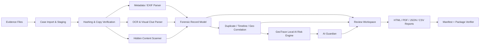
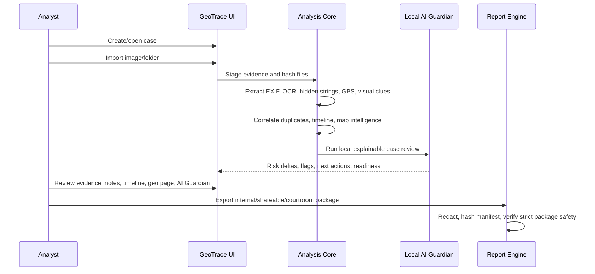

<p align="center">
  
</p>

<h1 align="center">GeoTrace Forensics X</h1>

<p align="center">
  <b>Offline-first digital forensics workspace for image metadata, GPS intelligence, OCR clues, hidden-content triage, AI-assisted risk scoring, chain-of-custody, and analyst-ready reporting.</b>
</p>

<p align="center">
  
  
  
  
  
</p>

<p align="center">
  <a href="#-quick-start">Quick Start</a> ·
  <a href="#-what-geotrace-does">Features</a> ·
  <a href="#-investigation-workflow">Workflow</a> ·
  <a href="#-ai-guardian--map-intelligence">AI Guardian</a> ·
  <a href="#-reports--export-modes">Reports</a> ·
  <a href="#-release-readiness">Release</a>
</p>

---

## Mission

**GeoTrace Forensics X** helps analysts turn image evidence into a structured forensic story:

- What does the file say about itself?
- Is the timestamp reliable?
- Is there GPS or screenshot-derived location context?
- Does the item belong to a suspicious timeline or geographic pattern?
- Are there duplicates, edits, hidden strings, URLs, OCR clues, or map traces?
- Can the evidence be exported safely without leaking sensitive paths, map assets, OCR text, usernames, emails, or exact coordinates?

GeoTrace is designed for **academic digital-forensics labs, classroom demos, OSINT-style image triage, and controlled investigative workflows**. It is not a magic verdict engine; it gives analysts explainable signals, evidence cards, export packages, and validation gates.

> **Default posture:** local processing, deterministic analysis, no remote AI, no automatic evidence upload.

---

## Visual Identity

<p align="center">
  
</p>

| Identity | Value |
|---|---|
| App name | `GeoTrace Forensics X` |
| Version | `12.8.8-map-intelligence` |
| Build channel | `Public Release Candidate` |
| Production spec | `geotrace_forensics_x.spec` |
| Demo/classroom spec | `geotrace_forensics_x_demo.spec` |
| Default AI mode | Local deterministic assistant |
| Remote AI | Disabled by default |
| Release script | `make_release.bat` |

---

## Why GeoTrace is different

Most image-metadata utilities stop at EXIF extraction. GeoTrace builds a full review workflow around the evidence:

| Layer | What it adds |
|---|---|
| **Forensic intake** | Evidence staging, source hash, working-copy hash, copy verification, acquisition notes |
| **Metadata analysis** | EXIF, native metadata, container metadata, device/camera/software signals, timestamp confidence |
| **Location intelligence** | Native GPS, derived location clues, map screenshot analysis, route detection, candidate place ranking |
| **OCR and visible context** | Visible text, Arabic/English OCR support through Tesseract, usernames, URLs, time strings, map labels |
| **Hidden-content triage** | Embedded strings, URLs, code-like markers, suspicious appended payload indicators |
| **Correlation** | Duplicate clusters, scene groups, timeline narrative, impossible travel signals, geographic outlier detection |
| **AI Guardian** | Local explainable risk deltas, next-best-action, evidence graph, contradiction explainer, courtroom readiness |
| **Export safety** | Internal, shareable, and courtroom redaction modes with manifest hashes and strict package verifier |

---

## What GeoTrace does

### Evidence and integrity

- Imports single files or folders into a case workspace.
- Creates a working copy without relying only on the original path.
- Calculates and stores SHA-256 and MD5 values.
- Verifies source and working-copy hashes.
- Tracks chain-of-custody events and custody summaries.
- Uses safe ZIP extraction for backup restore to block Zip Slip payloads.
- Supports case backup and restore flows.

### Metadata and image intelligence

- Extracts EXIF and native metadata.
- Separates native EXIF from container-level metadata.
- Detects camera make/model, device model, software/editor tags, lens, ISO, exposure, aperture, focal length, DPI, orientation, alpha channel, image size, frame count, and animation signals.
- Calculates metadata strength, metadata issues, recommendations, source profile, environment profile, parser status, structure status, and format trust.
- Scores evidentiary value separately from suspiciousness.

### Geolocation and map intelligence

- Decodes native GPS coordinates when present.
- Builds map artifacts for internal review.
- Extracts derived geolocation clues from OCR text, map labels, visible URLs, filenames, and known-place dictionaries.
- Detects map-like screenshots, Google Maps-like UI, route overlays, markers, possible city/area, landmarks, and candidate places.
- Caps confidence when the only signal is a filename to reduce false positives.
- Excludes sensitive map assets from strict redacted/courtroom packages.

### OCR and OSINT scene reading

- Uses `pytesseract` as a bridge to the native Tesseract engine.
- Supports quick OCR and deeper map-oriented OCR modes.
- Uses preprocessing variants for map screenshots: grayscale, sharpened, threshold, and high-contrast passes.
- Tracks OCR notes, confidence, analyst relevance, app names, usernames, URLs, map labels, time entities, location entities, and visible excerpts.
- Generates OSINT-style scene summaries such as whether an image appears to contain map, chat, browser, document, social, or metadata-thin content.

### Hidden-content triage

- Scans for readable embedded strings.
- Extracts visible and hidden URLs.
- Flags code-like markers and suspicious payload indicators.
- Produces hidden-content overview, hidden context summary, carved payload summary, and steganography suspicion notes.

### AI-assisted risk engine

GeoTrace includes a local, explainable AI-assistance layer. It is not a black-box verdict system.

It can identify:

- Location outliers across the case.
- Timeline/geography contradictions.
- Impossible travel candidates.
- Metadata authenticity clusters.
- Metadata-thin images that still contain visible map/location clues.
- Evidence relationships and duplicate peer context.
- Case-level readiness issues before export.

Each evidence item can store:

```text
ai_provider
ai_score_delta
ai_confidence
ai_risk_label
ai_summary
ai_flags
ai_reasons
ai_breakdown
ai_action_plan
ai_corroboration_matrix
ai_case_links
ai_evidence_graph
ai_contradiction_explainer
ai_courtroom_readiness
ai_next_best_action
ai_privacy_audit
ai_executive_note
ai_priority_rank
```

---

## Architecture



### Main modules

```text
app/
  agents/                  Local agent contracts and rule-based assistant bridge
  core/
    ai/                    Local AI feature extraction, detectors, planning, narrative, graph
    reports/               Package asset handling and courtroom verifier
    ai_engine.py           Compatibility entry point for AI-assisted batch scoring
    anomalies.py           Rule-based forensic anomaly scoring
    backup_utils.py        Safe archive extraction helpers
    case_db.py             Case persistence helpers
    case_manager.py        Investigation pipeline and score merging
    exif_service.py        Metadata, EXIF, OCR, hidden-content helpers
    explainability.py      Score explanations and analyst-facing reasons
    gps_utils.py           GPS parsing and geolocation helpers
    hashing.py             Hashing utilities
    map_intelligence.py    Map screenshot / place-candidate analysis
    map_service.py         Map rendering helpers
    migrations.py          Migration ledger scaffold
    models.py              EvidenceRecord and case data models
    ocr_runtime.py         OCR runtime and mode handling
    report_service.py      HTML/PDF/JSON/CSV/export package generation
    validation_service.py  Ground-truth validation helpers
    visual_clues.py        OCR entity and UI/app clue extraction
  ui/
    mixins/                Split PyQt5 workspace behavior
    pages/                 AI Guardian page and focused page modules
    dialogs.py             Dialogs and onboarding flows
    main_window.py         Main shell composition
    splash.py              Splash screen
    styles.py              Dark cyber UI stylesheet
    widgets.py             Shared widgets
    workers.py             Analysis/report worker threads
assets/                    Icon and splash assets
demo_evidence/             Demo corpus and validation ground truth
tests/                     Regression, report, UI smoke, agent, and release tests
```

---

## Investigation workflow



1. Create or switch to a case.
2. Import images or a folder.
3. GeoTrace stages evidence and verifies source/working hashes.
4. The pipeline extracts metadata, timestamps, GPS, OCR clues, URLs, visible text, hidden strings, and structure signals.
5. Duplicate and near-duplicate candidates are grouped.
6. Timeline and location signals are correlated.
7. AI Guardian reviews the batch for suspicious relationships, contradictions, outliers, and readiness gaps.
8. The analyst reviews the evidence queue, preview, metadata, hidden-content tab, timeline, map page, and AI Guardian.
9. Reports are exported in the correct privacy mode.
10. Strict packages are verified before sharing.

---

## AI Guardian & Map Intelligence

### AI Guardian panels

| Panel | Purpose |
|---|---|
| **Case Readiness** | Summarizes timeline, location, integrity, privacy, and courtroom readiness. |
| **AI Evidence Graph** | Shows relationships between evidence items, duplicates, geo links, and timeline links. |
| **Contradiction Explainer** | Highlights conflicting dates, unrealistic movement, or weak corroboration. |
| **Next Best Action** | Suggests the next analyst step without claiming final proof. |
| **Privacy Audit** | Reviews export posture for sensitive OCR, locations, raw names, and preview assets. |
| **Courtroom Readiness** | Indicates what still needs external corroboration before high-impact use. |

### Map Intelligence output

Each record can include:

```text
detected_map_context
possible_place
map_confidence
map_app_detected
map_type
route_overlay_detected
route_confidence
candidate_city
candidate_area
landmarks_detected
place_candidates
map_intelligence_confidence
map_ocr_language_hint
map_intelligence_summary
map_intelligence_reasons
map_evidence_basis
place_candidate_rankings
```

Example interpretation:

```text
Detected Map Context: Google Maps-like road/navigation screenshot
Possible Place: Cairo / Zamalek / Cairo Tower candidate
Map Confidence: 78%
Basis: OCR text + visual-map-colors + route-visual + known-place-dictionary
Analyst note: Treat as a lead until confirmed by native GPS, browser/app history, or independent source data.
```

---

## Reports & export modes

GeoTrace can export multiple report artifacts:

| Artifact | Purpose |
|---|---|
| HTML investigation report | Analyst-friendly technical case report |
| PDF report | Shareable static report for review/classroom handoff |
| JSON summary | Machine-readable evidence summary |
| CSV summary | Spreadsheet-friendly triage table |
| Executive summary | High-level case narrative and risk summary |
| AI Guardian summary | AI flags, graph links, contradictions, readiness notes |
| Validation summary | Ground-truth validation hits/misses for demo corpus |
| Courtroom summary | More conservative export focused on corroboration and readiness |
| Export manifest | SHA-256 integrity hashes for reports and safe report assets |
| Courtroom verifier output | Strict package validation result |

### Privacy levels

| Mode | Intended use | Included data posture |
|---|---|---|
| `full` | Internal analyst review | Raw file names, locations, OCR text, previews, and map artifacts may be present. |
| `path_only` | Internal sharing with reduced local path exposure | Reduces path disclosure but keeps more case context. |
| `redacted_text` | Shareable redacted package | Redacts paths, OCR text, usernames, emails, URLs, and location text. Sensitive map assets are excluded. |
| `courtroom_redacted` | Strict courtroom-style handoff | Uses strict redaction and verifier checks. Sensitive map assets such as `chart_map.png` and `geolocation_map.html` are blocked. |

### Strict package protection

The strict verifier checks for dangerous export mistakes, including:

- `chart_map.png` leaking into redacted/courtroom packages.
- `geolocation_map.html` leaking into redacted/courtroom packages.
- Manifest mismatches.
- Missing hashes for exported artifacts.
- Report asset integrity problems.

---

## Quick Start

### Option A — Windows helper scripts

```powershell
setup_windows.bat
run_windows.bat
```

### Option B — Manual Python run

```powershell
python -m venv .venv
.\.venv\Scripts\activate
python -m pip install --upgrade pip
python -m pip install -r requirements.txt
python main.py
```

### Optional AI/ML dependencies

GeoTrace works without these packages, but optional ML dependencies can improve heuristic support such as geographic outlier review.

```powershell
python -m pip install -r requirements-ai.txt
```

### Optional development/test dependencies

```powershell
python -m pip install -r requirements-dev.txt
python -m pytest -q
```

---

## OCR / Tesseract setup

`pytesseract` is only the Python bridge. The native **Tesseract OCR engine** must be installed on the operating system.

### Windows

1. Install Tesseract OCR.
2. Keep the default path when possible:

```text
C:\Program Files\Tesseract-OCR\tesseract.exe
```

3. Add the Tesseract install folder to the Windows `PATH`.
4. Restart PowerShell or Command Prompt.
5. Verify:

```powershell
tesseract --version
```

### Linux / Kali / Debian / Ubuntu

```bash
sudo apt update
sudo apt install -y tesseract-ocr tesseract-ocr-ara
tesseract --version
```

### macOS

```bash
brew install tesseract
tesseract --version
```

If OCR fails on Windows, launch GeoTrace from the same terminal where `tesseract --version` works. If the environment is locked down, use a local launcher that sets the full `tesseract.exe` path.

---

## Supported evidence formats

| Format | Notes |
|---|---|
| JPG / JPEG | Best native EXIF support |
| PNG | Screenshot and visible-context workflows |
| TIFF / TIF | Metadata-rich image handling |
| WEBP | Modern web image support |
| BMP | Basic structural/image support |
| GIF | Animation and parser/fallback review |
| HEIC / HEIF | Supported when `pillow-heif` is installed |

---

## Demo case

The repository includes a controlled demo corpus under `demo_evidence/`.

Recommended classroom/demo import set:

| File | Demonstrates |
|---|---|
| `cairo_scene.jpg` | Native EXIF and native GPS |
| `giza_scene.jpg` | Second geo anchor for map/timeline correlation |
| `edited_scene.jpg` | Edited/exported workflow comparison |
| `no_exif.png` | Metadata-thin asset |
| `no_exif_duplicate.png` | Duplicate/near-duplicate review |
| `IMG_20260413_170405_hidden_payload.png` | Hidden-content candidate |
| `Screenshot 2026-04-14 120501_Map_Cairo.png` | Map intelligence / derived location demo |
| `broken_animation.gif` | Parser/fallback review candidate |

> Production packages should exclude `demo_evidence`. Use `geotrace_forensics_x_demo.spec` only for demo/classroom builds.

---

## Screenshots

Before publishing a public GitHub release, capture real Windows screenshots from the final EXE or final source run.

Recommended files:

| Screen | Path |
|---|---|
| Dashboard | `screenshots/dashboard.png` |
| Evidence Queue / Review | `screenshots/evidence_queue.png` |
| Geo / Map Intelligence | `screenshots/geo_page.png` |
| AI Guardian | `screenshots/ai_guardian.png` |
| Report Export | `screenshots/report_export.png` |
| Courtroom Verifier | `screenshots/courtroom_verifier.png` |

Suggested screenshot rules:

- Use demo evidence only.
- Do not capture real personal paths, usernames, emails, or live case material.
- Prefer 1920×1080 or higher.
- Keep the app in the same dark theme across all images.
- Do not publish placeholder screenshots as final release screenshots.

---

## Testing

### Fast sanity checks

```powershell
python -m compileall -q app tests main.py
python -m pytest -q tests/test_release_readiness.py
python -m pytest -q tests/test_p0_p1_hardening.py
```

### Full test suite

```powershell
python -m pytest -q
```

### GUI smoke test checklist

- Launch the app.
- Create or open a case.
- Import the demo corpus.
- Run analysis.
- Open Dashboard, Evidence Queue, Geo page, AI Guardian, and Reports.
- Export Internal Full package.
- Export Shareable Redacted package.
- Export Courtroom Redacted package.
- Run the Courtroom Package Verifier.
- Confirm strict packages do not include sensitive map assets.

---

## Windows EXE build

### Production build

```powershell
build_windows_exe.bat
```

Expected output:

```text
dist\GeoTraceForensicsX\GeoTraceForensicsX.exe
```

### Demo/classroom build

```powershell
build_windows_demo_exe.bat
```

### Full release package

```powershell
make_release.bat
```

The release script is intended to:

- Clean cache/build/temp artifacts.
- Run compile checks.
- Run pytest gates.
- Build the production EXE.
- Create the release package.
- Generate `SHA256SUMS.txt`.

---

## Release readiness

Before publishing, complete the release gates below.

### Required automated gates

- [ ] `python -m compileall -q app tests main.py`
- [ ] `python -m pytest -q` on Windows
- [ ] `build_windows_exe.bat`
- [ ] Launch `dist\GeoTraceForensicsX\GeoTraceForensicsX.exe`
- [ ] Confirm production build uses `geotrace_forensics_x.spec`
- [ ] Confirm production build excludes `demo_evidence`
- [ ] Confirm demo build uses `geotrace_forensics_x_demo.spec`
- [ ] Confirm `release\SHA256SUMS.txt` is generated

### Required documentation gates

- [ ] README version matches `APP_VERSION`
- [ ] README build channel matches `APP_BUILD_CHANNEL`
- [ ] `LICENSE` exists
- [ ] `PRIVACY.md` exists
- [ ] `SECURITY.md` exists
- [ ] `DISCLAIMER.md` exists
- [ ] `THIRD_PARTY_NOTICES.md` exists
- [ ] Real screenshots are captured under `screenshots/`
- [ ] README screenshot links render correctly on GitHub

### Required privacy gates

- [ ] Redacted package excludes `chart_map.png`
- [ ] Redacted package excludes `geolocation_map.html`
- [ ] Courtroom package excludes `chart_map.png`
- [ ] Courtroom package excludes `geolocation_map.html`
- [ ] Manifest hashes every safe report asset
- [ ] Courtroom verifier catches strict package leaks
- [ ] No real evidence is present in `case_data`, `exports`, `logs`, `.temp`, `build`, or `dist` before publishing source

---

## Security model

GeoTrace is built around five safety principles:

1. **Local-first analysis** — evidence stays on the analyst machine by default.
2. **Deterministic fallback** — local rule-based analysis works even without optional ML dependencies.
3. **Evidence integrity** — source and working copies are hashed and tracked.
4. **Export minimization** — strict export modes reduce sensitive disclosure.
5. **Human review required** — AI and heuristics produce leads, not final legal conclusions.

Sensitive issue classes to report privately include:

- Evidence or report privacy leaks.
- Unsafe archive extraction or path traversal.
- Manifest/hash verification bypasses.
- Case corruption or destructive import/restore behavior.
- Unintended network transmission of evidence data.
- Packaging/dependency problems affecting analyst safety.

See [`SECURITY.md`](SECURITY.md) for reporting guidance.

---

## Privacy model

GeoTrace is offline-first by default. Evidence files, OCR text, extracted metadata, reports, hashes, and case snapshots are processed locally unless the user explicitly adds external tooling.

Remote AI integrations are blocked by default and should not be enabled for sensitive evidence unless the analyst has explicit authorization and a lawful basis.

See [`PRIVACY.md`](PRIVACY.md) for details.

---

## Limitations

GeoTrace is an investigation assistant, not an authority by itself.

- OCR can miss text, especially low-resolution, stylized, cropped, blurred, or multilingual screenshots.
- Derived geolocation from screenshots is a lead, not proof.
- Filename-only map/location signals are intentionally capped.
- AI Guardian findings are explainable triage signals, not final forensic conclusions.
- Native GPS can be absent, stripped, altered, or inconsistent with visible content.
- Reports should be reviewed before any external sharing.
- Courtroom or disciplinary use requires independent corroboration and qualified review.

---

## Roadmap

### Near term

- Add real release screenshots.
- Expand UI smoke tests.
- Improve map OCR coverage for Arabic/English labels.
- Strengthen validation dataset coverage.
- Split remaining large service modules where useful.
- Improve EXE smoke-test automation.

### Advanced roadmap

- Stronger compare workspace.
- Evidence acquisition wizard.
- Export signing.
- Validation dataset manager.
- More advanced OCR zoning for maps, chats, and browser screenshots.
- Optional local LLM summarization with strict privacy controls.
- Plugin-style AI agent interface for future local models.

---

## Responsible use

Use GeoTrace only on evidence you are authorized to examine. Do not use it to process private third-party material without permission, legal authority, or a valid academic/lab basis.

Outputs such as OCR results, map intelligence, risk scores, anomaly labels, AI Guardian summaries, and courtroom readiness notes must be reviewed and corroborated before being used in legal, disciplinary, employment, or high-impact decisions.

See [`DISCLAIMER.md`](DISCLAIMER.md).

---

## Third-party components

GeoTrace may use or integrate with:

- PyQt5
- Pillow / pillow-heif
- ExifRead / piexif
- ReportLab
- Folium
- Matplotlib
- pytesseract / Tesseract OCR
- NumPy / scikit-learn
- PyInstaller

Review dependency licenses before commercial redistribution. See [`THIRD_PARTY_NOTICES.md`](THIRD_PARTY_NOTICES.md).

---

## Arabic note

<details>
<summary>ملاحظات سريعة بالعربي</summary>

GeoTrace Forensics X أداة Desktop للتحليل الجنائي للصور. الهدف منها إنها تساعدك تربط بين الـEXIF، الـGPS، الـOCR، لقطات الخرائط، الملفات المتشابهة، التايملاين، والمخرجات النهائية في تقرير منظم.

الأداة لا ترفع الأدلة لأي خدمة خارجية بشكل افتراضي. أي نتائج من AI Guardian أو Map Intelligence تعتبر مؤشرات مساعدة للمحلل، وليست حكم نهائي. لازم يتم تأكيد النتائج بأدلة إضافية مثل بيانات الجهاز الأصلي، سجلات التطبيق، السحابة، أو أدوات Forensics مستقلة.

للنشر العام على GitHub، لازم تشغل الاختبارات على Windows، تبني نسخة EXE، تجربها من `dist`، تضيف Screenshots حقيقية، وتتأكد إن نسخ `redacted` و `courtroom` لا تحتوي على ملفات خرائط حساسة.

</details>

---

## License

This project is distributed with the license included in [`LICENSE`](LICENSE).

---

<p align="center">
  <b>GeoTrace Forensics X</b><br>
  Evidence integrity · Map intelligence · Local AI Guardian · Courtroom-aware reporting
</p>
