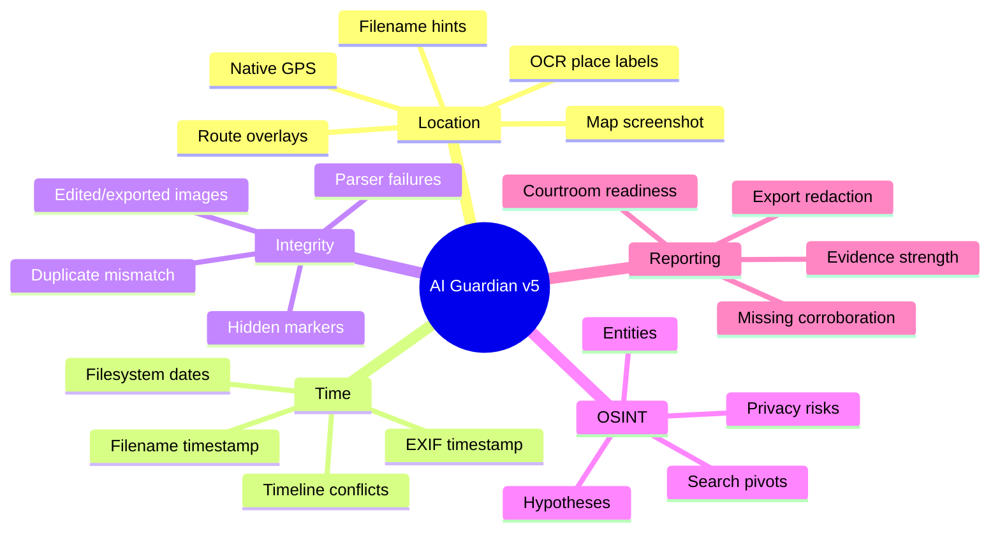
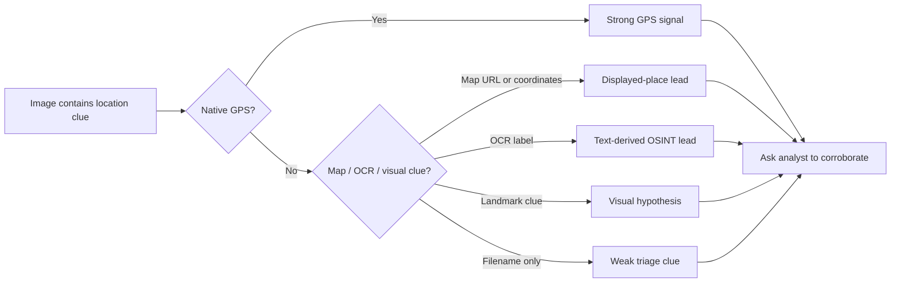
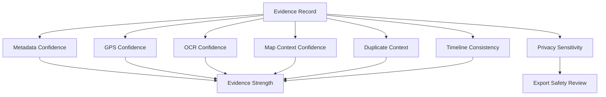
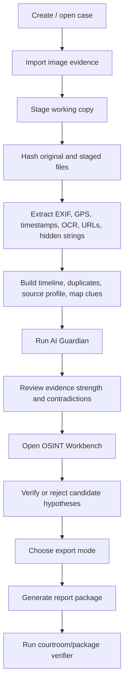

<div align="center">


# GeoTrace Forensics X

### AI-Assisted Image Forensics, Geolocation Triage & OSINT Case Reporting

**v12.9.2 — AI Guardian v5 / Deep Context Reasoner**  
**Public Release Candidate • Offline-first • Analyst-controlled • Evidence-safe**

<br />

[](#quick-start)
[](#interface-map)
[](#core-capabilities)
[](#osint--map-intelligence)
[](#privacy-safety--responsible-use)
[](LICENSE)

<br />

> **GeoTrace Forensics X** is a desktop investigation workspace for analyzing image evidence, extracting metadata, detecting location clues, building OSINT hypotheses, preserving chain of custody, and exporting professional forensic reports without turning weak clues into false certainty.

<br />

**Not a magic “find the exact location” button.**  
**A serious analyst cockpit for evidence, confidence, contradiction, and reporting.**

</div>

---

## Contents

- [Product Vision](#product-vision)
- [Why This Project Stands Out](#why-this-project-stands-out)
- [Core Capabilities](#core-capabilities)
- [AI Guardian v5](#ai-guardian-v5)
- [OSINT & Map Intelligence](#osint--map-intelligence)
- [Evidence Confidence System](#evidence-confidence-system)
- [Interface Map](#interface-map)
- [Investigation Workflow](#investigation-workflow)
- [Demo Storyline](#demo-storyline)
- [Quick Start](#quick-start)
- [OCR / Tesseract Setup](#ocr--tesseract-setup)
- [Testing & Quality Gates](#testing--quality-gates)
- [Build Windows EXE](#build-windows-exe)
- [Reports & Export Modes](#reports--export-modes)
- [Architecture](#architecture)
- [Security Model](#security-model)
- [Limitations](#limitations)
- [Roadmap](#roadmap)
- [Repository Checklist](#repository-checklist)
- [License](#license)

---

## Product Vision

Modern image investigations are messy. A single case can contain:

- a real camera photo with native GPS,
- a screenshot of Google Maps,
- a social-media image with stripped metadata,
- OCR text in Arabic or English,
- hidden strings or suspicious payload markers,
- duplicate images with conflicting context,
- timestamps from EXIF, filenames, filesystem metadata, and chat exports,
- privacy-sensitive URLs, usernames, emails, coordinates, and local paths.

Most tools show raw metadata. GeoTrace tries to answer the harder analyst question:

> **What does this evidence actually prove, what does it merely suggest, and what must be verified before reporting?**

GeoTrace Forensics X is built around **conservative forensic reasoning**. It helps the analyst move from raw image files to structured findings, while keeping every conclusion explainable, reviewable, and export-safe.

---

## Why This Project Stands Out

| Layer | What GeoTrace Does | Why It Matters |
|---|---|---|
| **Forensic extraction** | Reads EXIF, GPS, timestamps, file signatures, hidden strings, OCR text, duplicates, and source hints. | Gives the case a technical foundation instead of relying on screenshots only. |
| **Location reasoning** | Separates native GPS from map screenshots, OCR labels, visual landmarks, filename hints, and search/displayed-place clues. | Prevents the classic mistake: treating a map screenshot as proof of physical presence. |
| **AI Guardian** | Adds explainable risk flags, confidence basis, contradiction checks, next-best actions, and courtroom-readiness hints. | Makes the tool feel intelligent without becoming a black box. |
| **OSINT workbench** | Builds entities, hypotheses, search pivots, local landmark matches, candidate places, and privacy reviews. | Turns scattered clues into an investigation workflow. |
| **Reporting engine** | Produces HTML/PDF/JSON/CSV/executive/courtroom packages with redaction-aware modes and manifests. | Makes results usable for coursework, demos, internal review, and controlled case packages. |
| **Safety posture** | Offline-first, no automatic reverse image search, no automatic evidence upload, manual external OSINT gating. | Protects evidence, privacy, and legal boundaries. |

---

## Core Capabilities

### 1. Image Forensics Engine

- EXIF metadata extraction.
- Native GPS decoding.
- Timestamp discovery from EXIF, filenames, and filesystem context.
- Image signature and parser-failure handling.
- Hidden-content and embedded-string triage.
- Duplicate and near-duplicate grouping.
- Source/staged SHA-256 hashing.
- Evidence record persistence with chain-of-custody events.

### 2. Geolocation Triage

- Native GPS map visualization.
- Google Maps URL parsing.
- `geo:` URI parsing.
- DMS coordinate parsing.
- Plus Code signal detection.
- Map screenshot detection.
- Route/path context detection.
- OCR-based place-label extraction.
- Candidate city/place ranking.
- Country/region hints from Arabic and English clues.

### 3. OSINT Workbench

- Structured `OSINTEntity` extraction.
- Structured `OSINTHypothesis` cards.
- OCR query builder v2.
- Local landmark dataset matching.
- Image existence intelligence profile.
- Optional local CLIP-style extension point.
- Analyst decision states: `needs_review`, `verified`, `rejected`.
- OSINT appendix export.
- Privacy review before external lookup.

### 4. AI Guardian v5

- Deep context reasoning across evidence signals.
- Contradiction detection.
- Evidence-ladder explanation.
- Corroboration planning.
- Case narrator output.
- Courtroom readiness scoring.
- Privacy guardian checks.
- Next-best-action recommendations.

### 5. Reporting & Packaging

- HTML technical report.
- PDF report.
- JSON evidence export.
- CSV summary export.
- Executive summary.
- Validation summary.
- OSINT appendix.
- Courtroom package verifier.
- Manifest hashing for exported assets.
- Privacy-aware export modes.

---

## AI Guardian v5

AI Guardian is the intelligence layer of GeoTrace. It does **not** replace the analyst, and it does **not** claim final truth. It reads the case context and produces structured, explainable guidance.

### What AI Guardian Reviews



### AI Guardian Output Style

A good forensic assistant should say **why** something matters. GeoTrace stores AI reasoning fields per evidence item, including:

```text
ai_provider
ai_score_delta
ai_confidence
ai_risk_label
ai_summary
ai_flags
ai_reasons
ai_breakdown
```

Example output style:

```text
Review recommended
Reason: The image appears to show a map/search interface and contains OCR-derived place clues, but no native GPS exists.
Evidence strength: Lead
Next action: Verify the displayed place using source context or another GPS-confirmed item before reporting it as location evidence.
```

### Offline-first AI

The default assistant is deterministic and local. Optional AI/ML packages may enhance specific features, but GeoTrace is designed so the core workflow remains usable without remote services.

---

## OSINT & Map Intelligence

GeoTrace treats location as a **confidence problem**, not a single answer.

### Location Signal Ladder

| Rank | Signal | Strength | Reporting Language |
|---:|---|---|---|
| 1 | Native GPS EXIF | Strong indicator / proof candidate | “The image metadata contains GPS coordinates…” |
| 2 | Verified source-app location record | Strong when acquisition is documented | “The source record indicates…” |
| 3 | Map URL / coordinates visible in content | Lead | “The image displays/searched a location…” |
| 4 | OCR place names / map labels | Lead | “OCR suggests a possible place…” |
| 5 | Visual landmark / region clue | Weak-to-medium lead | “Visual context may be consistent with…” |
| 6 | Filename-only hint | Weak signal | “Filename contains a possible clue; not proof.” |

### Why This Matters

A map screenshot can show Cairo, London, or Tokyo without the device being there. GeoTrace intentionally avoids exaggerating this type of evidence.



### CTF GeoLocator Mode

For authorized OSINT practice, CTF training, and demo scenarios, GeoTrace includes a dedicated CTF GeoLocator workflow:

- clue cards,
- ranked `GeoCandidate` entries,
- location solvability score,
- manual verification buttons,
- rejected-candidate suppression,
- local landmark matching,
- live writeup support,
- CTF-style export.

---

## Evidence Confidence System

GeoTrace uses conservative language throughout the UI and reports.

| Label | Meaning | Example |
|---|---|---|
| **Proof / Strong Indicator** | High-value technical signal that may support a conclusion when acquisition is valid. | Native GPS EXIF from original camera media. |
| **Lead** | Useful investigative direction that needs corroboration. | OCR text showing a city name inside a map screenshot. |
| **Weak Signal** | Low-confidence clue that should not drive conclusions alone. | Filename contains `cairo` but metadata is missing. |

### Confidence Is Based On Multiple Factors



---

## Interface Map

GeoTrace is organized like an investigation cockpit.

| Area | Purpose |
|---|---|
| **Dashboard** | Case overview, counts, risk summary, and quick navigation. |
| **Evidence Queue** | Imported items, status, hashes, summaries, and review state. |
| **Review Panel** | Metadata, OCR, GPS, hidden-content, duplicates, and source context. |
| **Geo / Map Intelligence** | Native GPS map, derived map clues, possible places, confidence labels. |
| **AI Guardian** | Risk explanation, contradiction checks, confidence basis, next actions. |
| **OSINT Workbench** | Entities, hypotheses, candidate places, privacy review, OSINT appendix. |
| **CTF GeoLocator** | Training workflow for authorized geolocation challenges. |
| **Reports** | HTML/PDF/JSON/CSV/executive/courtroom exports. |
| **Verifier** | Checks exported packages, hashes, redaction rules, and unsafe assets. |

### Screenshot Plan

Before publishing publicly, add real screenshots under `screenshots/`:

| Screenshot | Suggested File |
|---|---|
| Dashboard | `screenshots/dashboard.png` |
| Evidence Review | `screenshots/evidence_review.png` |
| Geo / Map Intelligence | `screenshots/geo_page.png` |
| AI Guardian | `screenshots/ai_guardian.png` |
| OSINT Workbench | `screenshots/osint_workbench.png` |
| CTF GeoLocator | `screenshots/ctf_geolocator.png` |
| Report Export | `screenshots/report_export.png` |
| Courtroom Verifier | `screenshots/courtroom_verifier.png` |

> Keep placeholders out of the final public README. Use real screenshots captured from the production EXE or a clean source run.

---

## Investigation Workflow



### Recommended Analyst Flow

1. Create a clean case.
2. Import all related images together, not one by one.
3. Review source hash and staged hash.
4. Check native metadata first.
5. Review GPS, map clues, OCR, and hidden-content signals.
6. Let AI Guardian identify contradictions and next actions.
7. Treat OSINT candidates as hypotheses until verified.
8. Export an internal report first.
9. Export shareable/courtroom packages only after privacy review.
10. Run the verifier before sending anything outside the machine.

---

## Demo Storyline

Use the included `demo_evidence/` corpus for a strong live demo.

### Recommended Demo Set

| File | What It Demonstrates |
|---|---|
| `cairo_scene.jpg` | Native EXIF + GPS anchor. |
| `giza_scene.jpg` | Second geo anchor for timeline/map correlation. |
| `edited_scene.jpg` | Edited/exported workflow comparison. |
| `no_exif.png` | Metadata-thin image handling. |
| `no_exif_duplicate.png` | Duplicate/near-duplicate review. |
| `IMG_20260413_170405_hidden_payload.png` | Hidden-content review candidate. |
| `broken_animation.gif` | Parser/fallback safety behavior. |
| `Screenshot 2026-04-14 120501_Map_Cairo.png` | Map screenshot as a lead, not proof. |

### 5-Minute Demo Script

```text
1. Launch GeoTrace Forensics X.
2. Create a case named Demo Investigation.
3. Import the full demo_evidence set.
4. Open a GPS-bearing image and show metadata/GPS/map.
5. Open the map screenshot and show why it is only a displayed-place lead.
6. Open AI Guardian and highlight contradiction/next-action cards.
7. Open OSINT Workbench and verify/reject a candidate.
8. Export Internal Full report.
9. Export Shareable Redacted or Courtroom Redacted report.
10. Run the verifier and show manifest/hash validation.
```

### Demo Message

> “GeoTrace does not simply extract metadata. It explains evidence strength, separates proof from leads, identifies contradictions, protects privacy during export, and gives the analyst a structured path from raw images to a defensible report.”

---

## Quick Start

### Requirements

- Python **3.11+**
- Windows 10/11 recommended for final EXE workflow
- Linux/macOS supported for source execution where PyQt5 dependencies are available
- Tesseract OCR installed separately for OCR features
- Optional: AI/ML dependencies from `requirements-ai.txt`

### Run From Source — Windows PowerShell

```powershell
python -m venv .venv
.\.venv\Scripts\activate
python -m pip install --upgrade pip
python -m pip install -r requirements.txt
python main.py
```

### Windows Setup Script

```powershell
setup_windows.bat
run_windows.bat
```

### Optional AI / ML Dependencies

```powershell
python -m pip install -r requirements-ai.txt
```

If optional AI dependencies are missing, the application falls back to deterministic local logic.

---

## OCR / Tesseract Setup

GeoTrace uses `pytesseract`, but the native Tesseract executable must be installed on the operating system.

### Windows

Install Tesseract and keep the default path when possible:

```text
C:\Program Files\Tesseract-OCR\tesseract.exe
```

Then verify:

```powershell
tesseract --version
```

### Linux / Kali / Debian / Ubuntu

```bash
sudo apt update
sudo apt install -y tesseract-ocr tesseract-ocr-eng tesseract-ocr-ara
tesseract --version
```

### macOS

```bash
brew install tesseract
tesseract --version
```

### OCR Modes

| Mode | Purpose |
|---|---|
| Quick OCR | Fast text extraction for general triage. |
| Deep OCR | Better for map labels, screenshots, and difficult text. |
| Map Deep OCR | Focused on map screenshots and location labels. |
| Cached OCR | Avoids repeated processing of unchanged images. |

---

## Testing & Quality Gates

Run all tests:

```powershell
python -m pytest -q
```

Run compile checks:

```powershell
python -m compileall -q app tests main.py
```

Optional linting:

```powershell
python -m ruff check .
```

### Test Coverage Focus

| Test Area | What It Protects |
|---|---|
| AI deep context | Map-like layouts, displayed-location warnings, duplicate context mismatch. |
| AI Guardian | Evidence graph, readiness scoring, package verifier. |
| OSINT structured pipeline | Entities, hypotheses, map URL parsing, local gazetteer behavior. |
| Map intelligence | Visual-only score caps, OCR candidate lifting, false-positive reduction. |
| Privacy export | Redaction of OCR, URLs, filenames, device data, GPS, sensitive map assets. |
| Release readiness | Version sync, required docs, production spec, manifest hashes. |
| UI smoke imports | Ensures refactored UI modules import correctly. |
| Core forensics | GPS conversion, timestamp parsing, hidden content, duplicates, staging. |

---

## Build Windows EXE

### Production Build

```powershell
make_release.bat
```

Expected release checks include:

1. removing cache/build/temp artifacts,
2. running compile checks,
3. running tests,
4. building with the production PyInstaller spec,
5. excluding demo evidence from the production package,
6. generating release hashes.

### Manual EXE Smoke Test

After building:

```powershell
dist\GeoTraceForensicsX\GeoTraceForensicsX.exe
```

Then verify:

- the app launches,
- a case can be created,
- image import works,
- quick analysis works,
- OCR behavior is safe with and without Tesseract,
- Dashboard, Evidence Queue, Geo, AI Guardian, OSINT, Reports open correctly,
- Internal Full export works,
- Shareable Redacted export works,
- Courtroom Redacted export works,
- verifier detects unsafe package contents when expected.

---

## Reports & Export Modes

GeoTrace supports multiple outputs for different audiences.

| Export | Best For |
|---|---|
| HTML Technical Report | Full analyst review with rich structure. |
| PDF Report | Portable academic or case deliverable. |
| JSON Export | Machine-readable evidence archive. |
| CSV Export | Spreadsheet review and quick triage. |
| Executive Summary | Non-technical overview. |
| Validation Summary | Demo/testing comparison and sanity checks. |
| OSINT Appendix | Hypotheses, entities, candidate places, analyst decisions. |
| Courtroom Package | Integrity-focused package with manifest and verifier checks. |

### Export Modes

| Mode | Description |
|---|---|
| **Internal Full** | Maximum detail for the analyst or internal team. |
| **Shareable Redacted** | Reduces sensitive fields before sharing. |
| **Courtroom Redacted** | Stronger package discipline, manifest checks, and leakage verification. |

### Redaction Targets

- local file paths,
- raw OCR text,
- URLs,
- usernames,
- emails,
- device/source details,
- GPS coordinates,
- sensitive map assets,
- AI/internal notes where inappropriate for external sharing.

---

## Architecture

```text
GeoTrace Forensics X
├── app/
│   ├── agents/
│   │   ├── contracts.py              # Agent interface contracts
│   │   ├── factory.py                # Local/optional agent selection
│   │   └── rule_based_agent.py       # Safe local assistant behavior
│   ├── config.py                     # App identity, version, channel, release flavor
│   ├── core/
│   │   ├── ai/
│   │   │   ├── case_narrator.py
│   │   │   ├── confidence.py
│   │   │   ├── context_reasoner.py
│   │   │   ├── evidence_graph.py
│   │   │   ├── evidence_strength.py
│   │   │   ├── osint_content.py
│   │   │   ├── osint_scene.py
│   │   │   ├── planning.py
│   │   │   ├── privacy_guardian.py
│   │   │   └── visual_semantics.py
│   │   ├── case_manager/
│   │   ├── cases/
│   │   ├── exif/
│   │   ├── map/
│   │   ├── osint/
│   │   ├── reports/
│   │   ├── vision/
│   │   ├── anomalies.py
│   │   ├── case_db.py
│   │   ├── exif_service.py
│   │   ├── map_intelligence.py
│   │   ├── map_service.py
│   │   ├── ocr_modes.py
│   │   ├── ocr_runtime.py
│   │   └── validation_service.py
│   ├── ui/
│   │   ├── controllers/
│   │   ├── mixins/
│   │   ├── pages/
│   │   │   ├── ai_guardian_page.py
│   │   │   ├── ctf_geolocator_page.py
│   │   │   └── osint_workbench_page.py
│   │   ├── dialogs.py
│   │   ├── main_window.py
│   │   ├── splash.py
│   │   ├── styles.py
│   │   └── widgets.py
│   └── __init__.py
├── assets/
├── data/osint/
├── demo_evidence/
├── docs/releases/
├── screenshots/
├── tests/
├── main.py
├── make_release.bat
├── geotrace_forensics_x.spec
└── geotrace_forensics_x_demo.spec
```

### Design Principles

1. **Forensics first** — extraction and hashing must remain deterministic.
2. **AI as assistant, not judge** — AI suggests, explains, and prioritizes.
3. **OSINT as hypothesis** — external clues need verification.
4. **Privacy by design** — exports must reduce sensitive leakage.
5. **Reportability** — every finding should be understandable in a report.
6. **Future-agent ready** — agent contracts allow later local/remote LLM integration without rewriting the core.

---

## Security Model

GeoTrace is a forensic triage application, so the security model focuses on safe local evidence handling.

### Current Safety Controls

- Offline-first default behavior.
- No automatic reverse image search.
- No automatic upload of evidence.
- Manual privacy review before external OSINT pivots.
- Safe ZIP extraction protection.
- Redacted package asset filtering.
- Courtroom package verifier.
- Manifest hashing for exported assets.
- Production/demo PyInstaller separation.
- Logging instead of silent failures in sensitive paths.

### Responsible Use

Use GeoTrace only on evidence you are authorized to examine. The tool is suitable for:

- digital forensics coursework,
- CTF/OSINT training,
- internal investigation labs,
- controlled demo cases,
- authorized security research documentation.

It must not be used for stalking, doxxing, harassment, unauthorized surveillance, or unlawful tracking.

---

## Privacy, Safety & Responsible Use

GeoTrace can extract sensitive information from images, including locations, usernames, URLs, and OCR text. Treat all generated reports as sensitive by default.

Before sharing any export, review:

- whether raw GPS should be removed,
- whether OCR text contains private names or messages,
- whether local file paths expose analyst machine details,
- whether map screenshots reveal sensitive locations,
- whether report screenshots include private previews,
- whether the recipient needs internal details or a redacted package.

See:

- [`PRIVACY.md`](PRIVACY.md)
- [`SECURITY.md`](SECURITY.md)
- [`DISCLAIMER.md`](DISCLAIMER.md)

---

## Limitations

GeoTrace is intentionally conservative. It should not be presented as a guaranteed attribution engine.

| Limitation | Explanation |
|---|---|
| No automatic truth verdict | The tool provides evidence, confidence, and reasoning; final interpretation belongs to the analyst. |
| Map screenshots are not proof of presence | They may show searched/displayed places. Native GPS or source records are needed for stronger claims. |
| OCR may be wrong | Arabic/English OCR depends on image quality, installed language packs, and preprocessing. |
| Visual landmark detection is limited | Local heuristics and datasets can suggest leads, not final identification. |
| EXIF can be missing or modified | Metadata must be interpreted with acquisition context and chain-of-custody records. |
| Optional AI/ML is not required | The core workflow remains deterministic when optional packages are unavailable. |

---

## Roadmap

### Near-term Polish

- Add final real screenshots for public README.
- Improve UI spacing and responsive card layout.
- Expand demo script with before/after report examples.
- Add more regression tests for OCR/map false positives.
- Strengthen release checklist automation.

### OSINT Intelligence

- Larger offline landmark dataset.
- Better country/region classifier.
- Stronger Arabic map-label extraction.
- More robust route/path detection.
- Improved local image-existence intelligence.
- Richer corroboration matrix.

### AI Guardian

- More detailed next-best-action planner.
- Better contradiction explanation.
- Stronger courtroom readiness model.
- Optional local vision model integration.
- Analyst-tunable confidence thresholds.

### Reporting

- More polished PDF design.
- Print-friendly executive report.
- Appendix-level evidence traceability.
- Stronger manifest visualization.
- Report signing workflow.

---

## Repository Checklist

Before publishing or submitting:

- [ ] `APP_VERSION` in `app/config.py` matches README.
- [ ] `pyproject.toml` version matches README.
- [ ] `APP_BUILD_CHANNEL` matches README.
- [ ] `LICENSE`, `PRIVACY.md`, `SECURITY.md`, `DISCLAIMER.md`, and `THIRD_PARTY_NOTICES.md` exist.
- [ ] No `__pycache__`, `.pytest_cache`, `build`, `dist`, `.temp`, private case data, or real evidence are committed.
- [ ] Real screenshots are added under `screenshots/`.
- [ ] `python -m compileall -q app tests main.py` passes.
- [ ] `python -m pytest -q` passes.
- [ ] Production EXE launches from `dist`.
- [ ] Demo evidence is excluded from production release.
- [ ] Redacted/courtroom packages do not include sensitive map assets.
- [ ] Courtroom verifier passes on expected package.

---

## Version

```text
Application: GeoTrace Forensics X
Version:     12.9.2
Channel:     Public Release Candidate
Flavor:      AI Guardian v5 / Deep Context Reasoner
Python:      3.11+
UI:          PyQt5
```

---

## License

This project is released under the MIT License. See [`LICENSE`](LICENSE).

---

<div align="center">

### GeoTrace Forensics X

**Extract carefully. Reason conservatively. Report professionally.**

</div>
