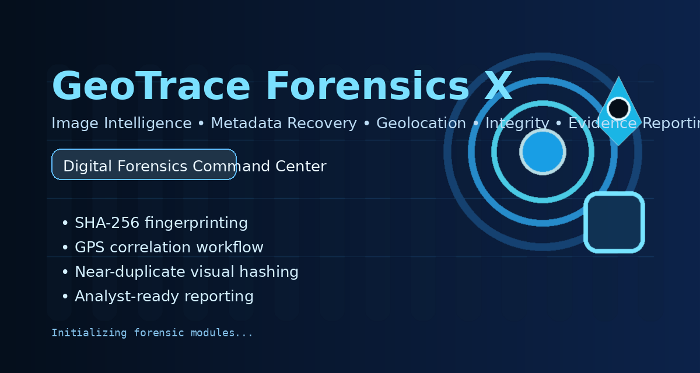

<p align="center">
  
</p>

<h1 align="center">GeoTrace Forensics X</h1>

<p align="center">
  <strong>A premium desktop digital-forensics command center for image intelligence, metadata recovery, GPS correlation, duplicate analysis, chain of custody, and analyst-ready reporting.</strong>
</p>

<p align="center">
  Acquire → Verify → Extract → Correlate → Score → Report
</p>

<p align="center">
  
  
  
  
</p>

<p align="center">
  
</p>

---

## Overview

**GeoTrace Forensics X** is a case-oriented desktop workspace for investigating image-based evidence with a practical digital-forensics workflow.

It combines:

- **metadata extraction** for EXIF, device, software, and format signals
- **timestamp recovery** from EXIF, filenames, and filesystem context
- **GPS decoding and geo correlation** when location data is present
- **near-duplicate clustering** using perceptual hashing
- **context-aware anomaly scoring** with risk and confidence signals
- **tamper-evident chain-of-custody logging** inside the case workflow
- **export-ready reporting** for analyst review, class presentations, and documentation

This repository is built to feel less like a basic parser and more like a **forensics command center**.

---

## Visual Tour

<p align="center">
  
</p>

<p align="center">
  
</p>

<p align="center">
  
</p>

---

## Why GeoTrace Feels Different

<table>
  <tr>
    <td width="50%" valign="top">
      <h3>Context-aware analysis</h3>
      <p>Missing EXIF is not treated blindly as suspicious. Screenshots, chat exports, edited media, and camera photos are interpreted with different expectations.</p>
    </td>
    <td width="50%" valign="top">
      <h3>Risk + confidence together</h3>
      <p>Each item is not only scored for risk, but also paired with a confidence signal so the analyst can explain how strong the conclusion is.</p>
    </td>
  </tr>
  <tr>
    <td width="50%" valign="top">
      <h3>More than file hashes</h3>
      <p>GeoTrace uses perceptual hashing to group visually similar media, making duplicate review stronger than simple byte-for-byte matching.</p>
    </td>
    <td width="50%" valign="top">
      <h3>Report-first workflow</h3>
      <p>HTML, PDF, CSV, JSON, executive summaries, validation summaries, and package manifests help turn raw evidence into a presentable case output.</p>
    </td>
  </tr>
  <tr>
    <td width="50%" valign="top">
      <h3>Case isolation and audit trail</h3>
      <p>Evidence is handled through isolated cases with custody events, notes, hashes, and validation context designed for traceability.</p>
    </td>
    <td width="50%" valign="top">
      <h3>Built for demos and coursework</h3>
      <p>The app is especially useful for academic digital-forensics demonstrations, project showcases, and structured evidence walk-throughs.</p>
    </td>
  </tr>
</table>

---

## Core Capabilities

### Metadata Intelligence

GeoTrace extracts and correlates a broad range of evidence signals, including:

- EXIF camera and device tags
- software/editor tags
- lens, ISO, exposure, focal length
- color mode, alpha channel, DPI, format
- filesystem timestamps
- filename-based timestamp recovery
- GPS coordinates and altitude when available
- visible text and screenshot clues when OCR support is available

### Timestamp Recovery

Instead of relying on a single timestamp source, the tool builds time context from multiple candidates:

- EXIF date/time fields
- filename patterns
- filesystem timestamps
- export-style naming conventions
- screenshot-oriented time hints when recoverable

This makes the workflow more practical for evidence that has been **forwarded, stripped, exported, or edited**.

### Duplicate & Similarity Analysis

GeoTrace supports duplicate review using both:

- **cryptographic hashing** for exact integrity checks
- **perceptual hashing** for visually similar or recompressed copies

This is useful when the same evidence appears in multiple forms across a case.

### Hidden / Structural Review

The hidden-content workflow is designed to reduce false positives:

- readable strings are preserved as analyst context
- stronger code-like markers are surfaced as more meaningful findings
- structural warnings help flag files that deserve extra manual review

### Chain of Custody

The case audit trail includes a simple hash-chained structure:

- each event stores `prev_hash`
- each event stores `event_hash`
- the chain can be validated during reporting

This is stronger than a plain event log and adds visible integrity reasoning to the workflow.

---

## Command Center Modules

| Module | What it gives the analyst |
|---|---|
| **Dashboard** | Case health, evidence counts, GPS coverage, duplicate coverage, and investigation KPIs |
| **Review** | Preview-first evidence triage and record-by-record analysis |
| **Metadata** | EXIF, device, format, editor, and filesystem context |
| **Timeline** | Recovered time candidates, chronology, and timestamp conflict support |
| **Geo / OSINT Leads** | GPS, map clues, coordinates, and location-oriented follow-up |
| **Compare** | Side-by-side review of related or near-duplicate evidence |
| **Audit** | Chain of custody, event history, and analyst notes |
| **Insights** | Charts for source types, risk distribution, GPS coverage, and duplicate clusters |

---

## Export Package

<p align="center">
  
</p>

A single case can generate a multi-file reporting package that may include:

- HTML report
- PDF report
- CSV evidence summary
- JSON evidence summary
- courtroom summary
- executive summary
- validation summary
- export manifest

This makes the project suitable not only for internal review, but also for **course submissions, demos, technical presentations, and investigation walkthroughs**.

---

## Investigation Methodology

GeoTrace is structured around a practical forensic pipeline:

1. **Acquire** — import one image or a full evidence folder into an isolated case.
2. **Verify** — compute hashes and register intake events.
3. **Extract** — recover metadata, timestamps, filesystem context, and visible clues.
4. **Correlate** — connect source type, timeline hints, GPS, and duplicate relationships.
5. **Score** — assign context-aware risk and confidence indicators.
6. **Report** — export a presentation-ready package for analyst review.

---

## Suggested Demo Flow

For a strong live demo or graduation-project presentation:

1. Import a small folder from `demo_evidence/`
2. Show the dashboard and case coverage metrics
3. Open one screenshot and explain why missing EXIF is not always suspicious
4. Open a camera-style image and walk through the metadata panel
5. Show the timeline view and recovered time candidates
6. Show duplicate clustering with a repeated screenshot pair
7. Open the geo lead when GPS or map clues exist
8. Generate the export package and open the final reports

---

## Quick Start

### Windows

```powershell
python -m pip install -r requirements.txt
python main.py
```

Or use the included batch files:

- `setup_windows.bat`
- `run_windows.bat`

### Build a Windows Executable

```powershell
py -m pip install pyinstaller
build_windows_exe.bat
```

---

## Supported Formats

GeoTrace currently supports the following media formats:

- JPG / JPEG
- PNG
- TIFF / TIF
- WEBP
- BMP
- GIF
- HEIC / HEIF *(via `pillow-heif`)*

---

## Keyboard Shortcuts

| Shortcut | Action |
|---|---|
| `Ctrl+N` | New case |
| `Ctrl+O` | Import files |
| `Ctrl+Shift+O` | Import folder |
| `Ctrl+R` | Generate reports |
| `Ctrl+F` | Focus search |
| `Ctrl+S` | Save notes |
| `Ctrl+,` | Open settings |
| `Ctrl+Shift+C` | Compare mode |
| `Ctrl+Shift+D` | Duplicate review |
| `Ctrl+1..7` | Switch pages |

---

## Project Structure

```text
GeoTrace Forensics X/
├─ app/
│  ├─ core/
│  │  ├─ anomalies.py
│  │  ├─ case_db.py
│  │  ├─ case_manager.py
│  │  ├─ exif_service.py
│  │  ├─ explainability.py
│  │  ├─ gps_utils.py
│  │  ├─ hashing.py
│  │  ├─ map_service.py
│  │  ├─ models.py
│  │  ├─ report_service.py
│  │  ├─ validation_service.py
│  │  └─ visual_clues.py
│  └─ ui/
│     ├─ dialogs.py
│     ├─ main_window.py
│     ├─ styles.py
│     └─ widgets.py
├─ assets/
│  ├─ app_icon.png
│  └─ splash.png
├─ demo_evidence/
├─ docs/readme/
├─ tools/
├─ tests/
├─ main.py
└─ requirements.txt
```

---

## Windows Notes

- `run_windows.bat` and `setup_windows.bat` create a project-local temporary directory to avoid the common Windows TEMP/TMP issue.
- OCR support is optional. `pytesseract` is listed in `requirements.txt`, but full OCR functionality also requires **Tesseract OCR** to be installed and available on system PATH.
- If OCR is unavailable, the application still runs and reports that OCR support is missing instead of failing silently.

### If Windows still reports a TEMP / TMP problem

Run:

```powershell
fix_windows_temp.bat
```

Then open a **new terminal** and run setup again.

---

## Design Notes

This project intentionally separates **structural validation** from **origin certainty**.

That means:

- **Verified** does not automatically prove legal authenticity or provenance
- **Partial** can still be useful evidence with limited parser or metadata support
- **Review Required** signals that the analyst should manually inspect or corroborate the record

This makes the tool more realistic for teaching and investigation workflows.

---

## Roadmap Ideas

Some strong next-step upgrades for the project:

- real UI screenshots inside the README gallery
- richer map intelligence and external geospatial enrichment
- stronger evidence-comparison workspace
- clearer explainability cards for scoring decisions
- case templates for different investigation scenarios
- plugin-style import and export extensions

---

## Status

This repository currently contains:

- the desktop application source
- demo evidence for walkthroughs
- tests for core workflows
- batch files for Windows setup and run
- PyInstaller packaging support

---

## License

Add your preferred license here.

Example:

```text
MIT License
```

---

## Author / Team

Add your name, team, course, or project attribution here.
